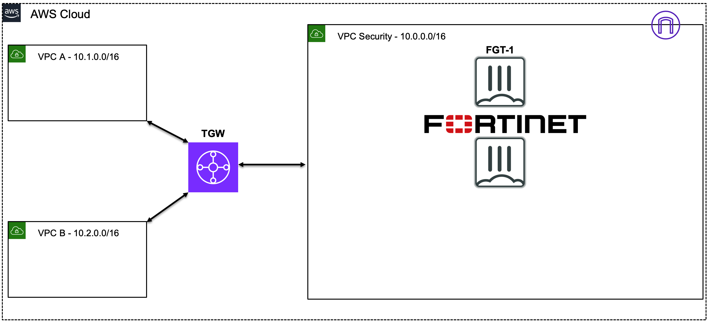

# FortiGate: Protecting AWS Traffic Flows

## Learning Objectives

Upon completion of this workshop, you will gain an understanding of:
  
  * AWS networking concepts *(10 minutes)*
  * AWS common architecture patterns *(10 minutes)*
  * FortiGate FortiOS terminology *(10 minutes)*
  * Creating and applying firewall policies with security profiles and objects to control traffic flows *(10 minutes)*
  * Testing traffic flows to validate the implemented networking and security controls *(20 minutes)*

## Workshop Components

The following Fortinet & AWS components will be used during this workshop:

  * AWS EC2 instances (Amazon Linux OS, FortiGate NGFW)
  * AWS networking components:
    * VPCs
    * Subnets
    * Route Tables (RTBs)
    * Transit Gateway (TGW)
  * FortiGate instances running FortiOS (Amazon Machine Images (AMI) on EC2)

## AWS Reference Architecture Diagram

AWS networking offers multiple ways to organize your AWS architecture to take advantage of FortiGate traffic inspection. The most important part of designing your network is to ensure **traffic follows a symmetrical routing path** (for forward and reverse flows). As long as flows are symmetrical, the architecture will work and traffic will flow through the FortiGate NGFW for inspection.
  
We will investigate the configuration of different architecture patterns, including:  

  * **Ingress + Egress in a single VPC**  
  * **Centralized Inspection of Ingress + Egress + East/West with multiple VPCs**  

