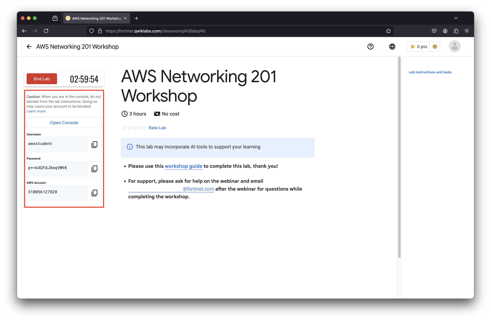

#### New User Provisioning
 

After submitting, this page will return with a blank email address box and no other indications.    
    
<b><i>PLEASE DO NOT SUBMIT MULTIPLE TIMES</b></i>





## Accessing QwikLabs & AWS environment

For Fortinet cloud workshops, we will use [**QwikLabs**](https://fortinet.qwiklabs.com/paths) to provide a pre-staged AWS account with the workshop environment ready to use.

- After logging into [**QwikLabs**](https://fortinet.qwiklabs.com/paths), click **Dashboard** (top of page).
- Find and select **FortiGate: AWS Networking 201 Workshop**.
- Click the green **Start Lab** button to begin.

{}
Provisioning the lab can take more than 15 minutes once started. This environment will then run for 3 hours and then automatically shutdown and clean up all resources. If you restart the lab, you will start with a clean environment where you must begin at the beginning again.
{}

Once the environment has finished provisioning, check the QwikLabs Console left menu (see screenshot below) to find your AWS login URL and credentials, along with other useful information you will need throughout your lab. You may now proceed to the [**hands-on section of the lab**]().

