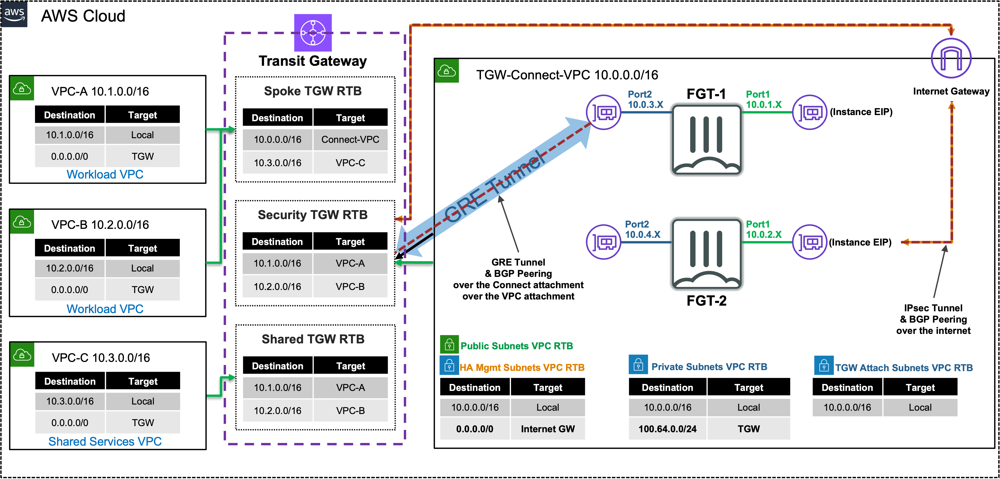

 
|                            |    |  
|:--------------------------:|:----|
| **Goal**                   | Utilize dynamic routing with Transit Gateway and FortiGates.
| **Task**                   | Create attachment associations + propagations and configure FortiGate routes and firewall policies to allow secured traffic to pass.
| **Validation** | Confirm outbound and east/west connectivity from EC2 Instance-A via Ping, HTTP, HTTPS.

## Introduction
In this task, there are multiple VPCs in the same region that have one instance each. Transit Gateway is configured with multiple Transit Gateway Route Tables.  You will need to create the appropriate VPC attachment associations and propagations to the correct TGW Route Tables, FW policy, and update BPG configuration on the independent FortiGates.

In this scenario the FortiGates are completely independent of each other (not clustered, nor sharing config/sessions, etc.) and are showing different connectivity options to attach remote locations to Transit Gateway. VPN attachments can be used to connect to any IPsec capable device located anywhere.  TGW Connect attachments require a private path to reach a VM deployed in a VPC or HW/VM deployed on premise and must be reachable over Direct Connect (a dedicated, private circuit).




## Summarized Steps (click to expand each for details)

###### 0) Lab environment setup

{}


- **0.1:** Login to your AWS account, and click **the Launch Stack button below** below to launch the CloudFormation stack for Task 3

[](https://console.aws.amazon.com/cloudformation/home#/stacks/create/review?stackName=task3&templateURL=https%3A%2F%2Fhacorp-cloud-cse-workshop-us-east-1.s3.amazonaws.com%2Faws-fgt-201%2FMaster_FGT_201_Part3.template.json)

- **0.2:** **You must:** 
    - **select the existing IAM role `qls-...CloudFormationServiceRole...` in the Permissions section**
	- **check the boxes to acknowledge the warnings in the Capabilities section**
	- then scroll down and click **Create stack**

{}
**If you do not select the existing IAM role and continue with the stack creation, this will fail!** If this occurred, simply create another stack with a different name and follow the steps closely for this section. 
{}
  
  

- **0.3:** The CloudFormation stack will take ~10 minutes to finish deploying. Once the main/root CloudFormation stack shows as **Create_Complete**, proceed with the steps below.

    {}

###### 1) Check the Transit Gateway Route Tables and confirm east/west is not working

{}

- **1.1:** In the **VPC Console** go to the **Transit gateway route tables page** (menu on the left) and check out all the **associations, propagations, and routes** for **each Transit gateway route table**. You can quickly **compare the attachment IDs** to the assigned names by opening another tab for the **Transit gateway attachments page**. You should see the following:

Transit Gateway Route Table Name | Associations
---|---
TGW-Connect-security-tgw-rtb | TGW-Connect-security-vpc-attachment <br> TGW-Connect-security-connect-attachment <br> Unnamed-vpn-attachment |
TGW-Connect-spoke-tgw-rtb | VPC-A-spoke-vpc-attachment <br> VPC-B-spoke-vpc-attachment |
TGW-Connect-sharedservices-tgw-rtb | VPC-C-spoke-vpc-attachment |

Transit Gateway Route Table Name | Propagations
---|---
TGW-Connect-security-tgw-rtb | VPC-A-spoke-vpc-attachment <br> VPC-B-spoke-vpc-attachment <br> VPC-C-spoke-vpc-attachment |
TGW-Connect-spoke-tgw-rtb | VPC-C-spoke-vpc-attachment <br> TGW-Connect-security-vpc-attachment <br> TGW-Connect-security-connect-attachment <br> Unnamed-vpn-attachment |
TGW-Connect-sharedservices-tgw-rtb | VPC-A-spoke-vpc-attachment <br> VPC-B-spoke-vpc-attachment |

Transit Gateway Route Table Name | Routes
---|---
TGW-Connect-security-tgw-rtb | 10.1.0.0/16 <br> 10.2.0.0/16 <br> 10.3.0.0/16 |
TGW-Connect-spoke-tgw-rtb | 10.0.0.0/16 <br> 10.3.0.0/16 |
TGW-Connect-sharedservices-tgw-rtb | 10.1.0.0/16 <br> 10.2.0.0/16 |

- **1.2:** Navigate to the **EC2 Console** and connect to **Instance-A** using the **[Serial Console directions](../3_modulethree.html)** 
    - Password: **`FORTInet123!`**
- **1.3:** Run the following commands to test connectivity and make sure the results match expectations 
  SRC / DST | VPC B | Internet                                            
  ---|---|---
  **Instance A** | **`ping 10.2.2.10`**  | |
  **Instance A** | | **`curl ipinfo.io`**  |

{}
		
###### 2) Review FortiGate1's GRE + BGP config and advertise a summary route to Transit Gateway

{}

- **2.1:** Navigate to the **CloudFormation Console** and **toggle View Nested to off**.
- **2.2:** Select the main template and select the **Outputs tab**.
- **2.3:** Login to **FortiGate1**, using the outputs **FGT1LoginURL**, **Username**, and **Password**.
- **2.4:** Upon login in the **upper right-hand corner** click on the **>_** icon to open a CLI session.
- **2.5:** Run the command **`show system gre`** and notice **the interface and IPs that are used are private**.
- **2.6:** Run the command **`show system interface tgw-conn-peer`** and notice **the IPs assigned to the inside interfaces of the GRE tunnel**.
- **2.7:** Run the command **`show router bgp`** and notice the **BGP peers fall into the remote-ip CIDR** in the output of the command above.
- **2.8:** Run the command **`get router info routing-table all`** and notice the **routes received match the routes tab of TGW-Connect-security-tgw-rtb**.
- **2.9:** Copy and paste the commands below to configure a 10.0.0.0/8 summary route to be advertised back to Transit gateway:
  ```
  config router bgp
  config aggregate-address
  edit 1
  set prefix 10.0.0.0 255.0.0.0
  set summary-only enable
  next
  end
  end
  ```
- **2.10:** Run the commands below to confirm that the 10.0.0.0/8 route is now being advertised to our BGP neighbors.
  ```
  get router info bgp summary
  get router info bgp neighbors 169.254.6.2 advertised-routes
  get router info bgp neighbors 169.254.6.3 advertised-routes
  ```
    {}

###### 3) Test east/west connectivity from Instance-A to Instance-B and validate there is no internet connectivity

{}

- **3.1:** While still in the console session for Instance-A, run the following commands to test connectivity and make sure the results match expectations
- 
  SRC / DST | VPC B                              | Internet
  ---|------------------------------------|---
  **Instance A** | **`ping 10.2.2.10`**  | **`ping 8.8.8.8`** 
  **Instance A** | **`curl 10.2.2.10`**  | **`curl ipinfo.io`** 

    {}

###### 4) Let's dig deeper to understand how all of this works

{}

- **4.1:** High level diagram showing how the Connect attachment goes over a VPC attachment which allows FortiGate1 to have a GRE tunnel over a private path which has BGP peering configured as well.  This provides an overlay tunnel where dynamic routes and data-plane traffic can be routed without adding additional routes to the VPC router.
	

	
{}	
FortiGate1 is getting data-plane traffic over a GRE tunnel between it's port2 private IP (10.0.3.x/24) and an IP out of Transit Gateway CIDR block (100.64.0.x/24).  This GRE tunnel is going over the TGW-Connect-security-connect-attachment, so this is all over a private path. Also Transit Gateway can support jumbo frames up to 8500 bytes for traffic between VPCs, AWS Direct Connect, Transit Gateway Connect, and peering attachments. However, traffic over VPN connections can have an MTU of 1500 bytes. Find out more in [**AWS Documentation**](https://docs.aws.amazon.com/vpc/latest/tgw/transit-gateway-quotas.html#mtu-quotas).

BGP peering can be either iBGP or eBGP but the IP addressing will always use the inside tunnel IPs from a specific selection of CIDRs from 169.254.0.0/16.  To find out which ones can or can't be used, please reference [**AWS Documentation**](https://docs.aws.amazon.com/vpc/latest/tgw/tgw-connect.html#tgw-connect-peer).

Regardless which type of BGP is used, each connect peer is only required to create one GRE tunnel to peer to the redundant BGP peers on the Transit Gateway side. For more information, reference [**AWS Documentation**](https://aws.amazon.com/blogs/networking-and-content-delivery/simplify-sd-wan-connectivity-with-aws-transit-gateway-connect/).
{}

    {}

###### 5) Review FortiGate2's VPN and BGP configurations

{}

- **5.1:** Navigate to the **CloudFormation Console** and **toggle View Nested to off**.
- **5.2:** Select the main template and select the **Outputs tab**.
- **5.3:** Login to **FortiGate2**, using the outputs **FGT2LoginURL**, **Username**, and **Password**.
- **5.4:** Upon login in the **upper right-hand corner** click on the **>_** icon to open a CLI session.
- **5.5:** Run the command **`show vpn ipsec phase1-interface`** and notice **there are two tunnels where the remote-gw values are different public IPs and the interfaces are port1**.
- **5.6:** Run the command **`show router route-map rmap-aspath1`** and notice **the as-path is set to 65000**.
- **5.7:** Copy and paste the commands below to configure default-route-originate with the route-map to advertise 0.0.0.0/0 with an as-path of 65000:
  ```
  config router bgp
  config neighbor
  edit 169.254.10.1
  set capability-default-originate enable
  set default-originate-routemap rmap-aspath1
  next
  edit 169.254.11.1
  set capability-default-originate enable
  set default-originate-routemap rmap-aspath1
  next
  end
  end
  ```
- **5.8:** Run the commands below to confirm that the 0.0.0.0/0 route is now being advertised to our BGP neighbors with an as-path of 65000.
  ```
  get router info bgp summary
  get router info bgp neighbors 169.254.10.1 advertised-routes
  get router info bgp neighbors 169.254.11.1 advertised-routes
  ```

    {}

###### 6) Test secured egress connectivity from Instance-A through FortiGate2

{}

- **6.1:** While still in the console session for Instance-A, run the following commands to test connectivity and make sure the results match expectations

  SRC / DST | VPC B                              | Internet
  ---|------------------------------------|---
  **Instance A** | **`ping 10.2.2.10`**  via FGT1 | **`ping 8.8.8.8`**  via FGT2
  **Instance A** | **`curl 10.2.2.10`**  via FGT1 | **`curl ipinfo.io`**  via FGT2
  - Ping and curl to public resources should connect successfully through FGT2 which is connected to Transit Gateway over a VPC attachment (IPsec + BGP over the internet).
  - **Notice** that the public IP returned from **`curl ipinfo.io`** should match the **public IP of FGT2**
- **6.2:** In the **VPC Console** go to the **Transit gateway route tables page**.
- **6.3:** Find **TGW-Connect-spoke-tgw-rtb** go to the **Routes tab** and notice there are **ECMP routes for 0.0.0.0/0** since there are two VPN tunnels configured and a **single route for 10.0.0.0/8** for the TGW connect peer.
	
{}	
FortiGate2 is getting data-plane traffic over **two IPsec tunnels** between its port1 private ip (10.0.2.x/24) that has an associated [**Elastic IP**](https://docs.aws.amazon.com/AWSEC2/latest/UserGuide/elastic-ip-addresses-eip.html) and two public IPs managed by AWS, so this is all over a public path but encrypted. This means that jumbo frames are not supported for VPN based attachments.

Since there are two tunnels with a BGP peer configured for each, FortiGate2 is able to advertise ECMP paths which Transit Gateway can use.  [**TGW supports ECMP**](https://docs.aws.amazon.com/vpc/latest/tgw/how-transit-gateways-work.html#tgw-ecmp) for different attachment types.
{}

    {}


###### 7) Configure FortiGate1 with default-route-originate and a route-map as well

{}

- **7.1:** Login to **FortiGate1**, using the outputs **FGT1LoginURL**, **Username**, and **Password**.
- **7.2:** Upon login in the **upper-right-hand corner** click on the **>_** icon to open a CLI session.
- **7.3:** Run the command **`show router route-map rmap-aspath1`** and notice **the as-path is set to 65000 just like FortiGate2**.
- **7.4:** Copy and paste the commands below to configure default-route-originate with the route-map to advertise 0.0.0.0/0 with an as-path of 65000:
  ```
  config router bgp
  config neighbor
  edit 169.254.6.2
  set capability-default-originate enable
  set default-originate-routemap rmap-aspath1
  next
  edit 169.254.6.3
  set capability-default-originate enable
  set default-originate-routemap rmap-aspath1
  next
  end
  end
  ```
- **7.5:** Run the commands below to confirm that the 0.0.0.0/0 route is now being advertised to our BGP neighbors with an as-path of 65000.
  ```
  get router info bgp summary
  get router info bgp neighbors 169.254.6.2 advertised-routes
  get router info bgp neighbors 169.254.6.3 advertised-routes
  ```
    {}

###### 8) Test secured egress connectivity from Instance-A through FortiGate1

{}

- **8.1:** While still in the console session for Instance-A, run the following commands to test connectivity and make sure the results match expectations

  SRC / DST | VPC B                              | Internet
  ---|------------------------------------|---
  **Instance A** | **`ping 10.2.2.10`**  via FGT1 | **`ping 8.8.8.8`**  via FGT1
  **Instance A** | **`curl 10.2.2.10`**  via FGT1 | **`curl ipinfo.io`**  via FGT1
  - Ping and curl should connect successfully through FGT1 which is connected to Transit Gateway over a Connect attachment (GRE + BGP over a VPC attachment).
  - **Notice** that the public IP returned from **`curl ipinfo.io`** should match the **public IP of FGT1**
- **8.2:** In the **VPC Console** go to the **Transit gateway route tables page**.
- **8.3:** Find **TGW-Connect-spoke-tgw-rtb** go to the **Routes tab** and notice there **is only one route for 0.0.0.0/0 since Transit Gateway only supports ECMP routing from the same attachment types**.

{}
While Transit Gateway does support ECMP routing, it only does so for the same attachment types. There is a [**route evaluation order**](https://docs.aws.amazon.com/vpc/latest/tgw/how-transit-gateways-work.html#tgw-route-evaluation-overview) that takes place. The reason behind this is that different attachment types go over different paths (ie connect over private vpc-attachment vs vpc over public internet) which can have different latency, RTTs, etc. and even different MTUs supported.
{}

    {}

###### 9) Lab environment teardown

{}

- **9.1:** Navigate to the **CloudFormation Console**, select the main stack you created and click **Delete**.
- **9.2:** The CloudFormation stack will take ~10 minutes to clean up. Once the stack is deleted, proceed to the next task.

    {}

## Discussion Points
- TGW Connect & VPN attachments allow a simple means to connecting remote resources to TGW
- These attachment types are also helpful when dynamic routing is needed for a design
   - Connect uses GRE + BGP to privately connect to an appliance reachable via Direct Connect or within a VPC
   - VPN uses IPsec + BGP to publicly connect to an appliance reachable over the Internet
- TGW has a route evaluation priority to select the best path when multiple routes have the same CIDR
- TGW supports ECMP routing with routes from the same attachment type
   - TGW is a stateless router which will result in asymmetric routing of traffic
   - SNAT is required for flow symmetry to the correct FortiGate in Active-Active design
   - Simple & scalable Active-Active for Ingress/Egress inspection
   - Active-Active for East/West inspection possible with caveats
- Each TGW VPN connection (2x IPsec tunnels per connection) supports up to 2.5 Gbps
- Each TGW Connect peer supports up to 5 Gbps
- TGW supports multiple peers per TGW Connect attachment and multiple attachments to a single VPC
- TGW supports multiple VPN attachments to the same or different customer gateway (remote IPsec appliance)
- Jumbo frames (8500 bytes) are supported for all attachments except VPN (1500 bytes)

**This concludes this task**
