|      |   |  
|:----:|:--|
| **Goal**                   | Utilize Cloud WAN components and Core Network Policy to provide a secured & orchestrated network.
| **Task**                   | Update Core Networking Policy with logic to automate connecting resources to segments and propagating routes to allow secured traffic flow.
| **Validation** | Confirm east/west connectivity from EC2 Instance-A via Ping, HTTP.

## Introduction
In this design, there are multiple VPCs in the same region that have one instance each. Cloud WAN is configured with multiple segments and attachments (both VPC and Tunnel-less Connect).  You will need to create the appropriate Cloud WAN Core Network Policy to automatically enforce segment attachment rules and propagation of routes between segments to direct traffic to the independent FortiGates for traffic inspection.

In this setup these FortiGate are independent (not clustered, nor sharing config) but are working together with FGSP in an Active-Active design to provide more capacity and synchronize session tables. This design specifically uses Tunnel-less Connect attachments to allow dynamic routing between EC2 instances and a Cloud WAN Core Network Edge (CNE) without needing IPsec or GRE based overlay tunnels. This removes the overhead and bottlenecks that come with overlay tunnel protocols while still providing dynamic routing. 

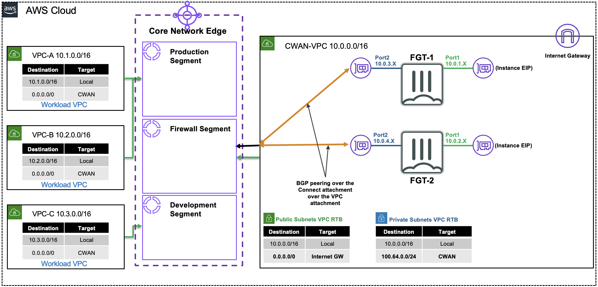

## Summarized Steps (click to expand each for details)

###### 0) Lab environment setup

{}

- **0.1:** Login to your AWS account and navigate to the **CloudFormation Console** and **toggle View Nested to off**.
- **0.2:** Make sure you are in the **United States (Oregon) region** as this is where the stack should be deployed.
    {}
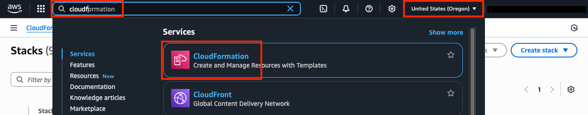
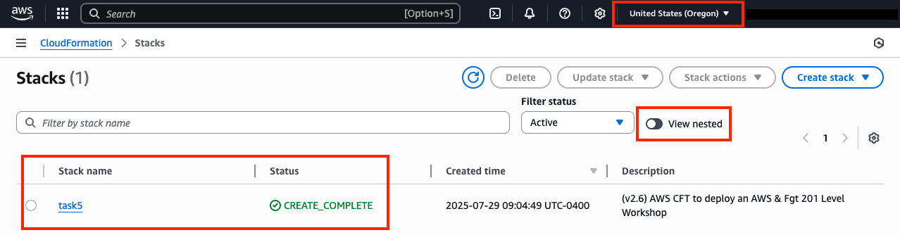
    {}

  {}
All AWS resources for this lab will be deployed in the **United States (Oregon) region**. Either switch the region for your existing browser tabs (using the region selector in the upper right corner of the AWS Console) to this region or close all other browser tabs. Otherwise, you might accidently configure the wrong AWS resources.
  {}

- **0.3:** Select the main stack and confirm the stack has **finished creating successfully** by looking at the **Events Tab**.
    {}
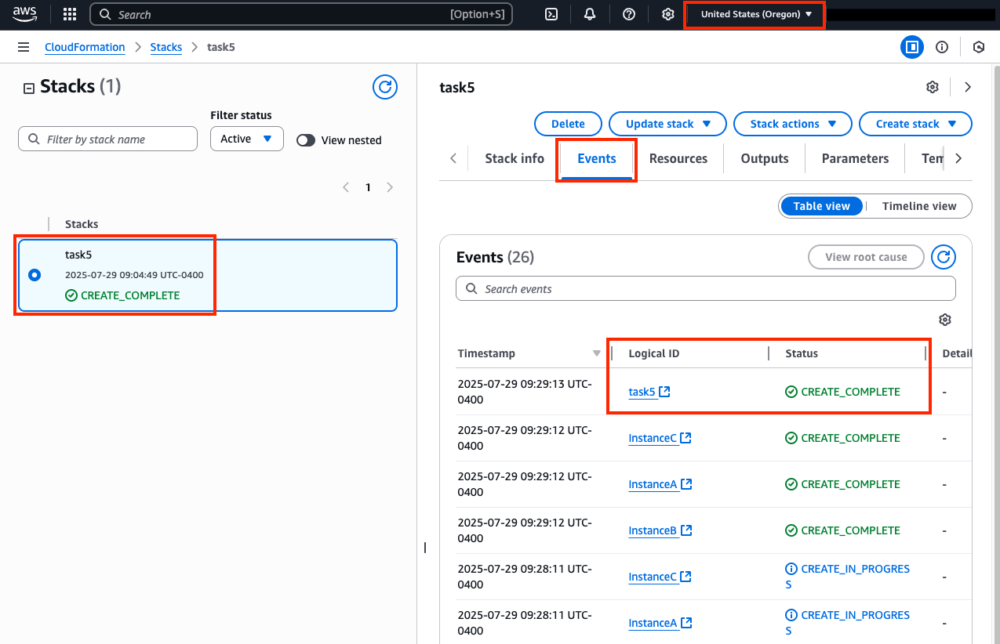
    {}

- **0.4:** You are now ready to proceed with the rest of the lab below **starting in section 1**. The remaining steps for this section are if the main stack failed to create successfully.

{}
If the original stack failed to create, please notify those giving the workshop to review the root cause of the issue. Once that is done, please proceed with the remaining steps for this section.
{}

- **0.5:** **Delete the previously failed main stack and wait till that has completed successfully**. Please use the refresh buttons to refresh both the left and right portions of the CloudFormation Console.
- **0.6:** Click **the yellow Launch Stack button directly below this sentence** to launch the CloudFormation Stack for Task 5

- **0.7:** **You must:** 
    - **select the existing IAM role `qls-...CloudFormationServiceRole...` in the Permissions section**
	- **check the boxes to acknowledge the warnings in the Capabilities section**
	- then scroll down and click **Create stack**

{}
**If you do not select the existing IAM role and continue with the stack creation, this will fail!** If this occurred, simply create another stack with a different name and follow the steps closely for this section. 
{}
  
  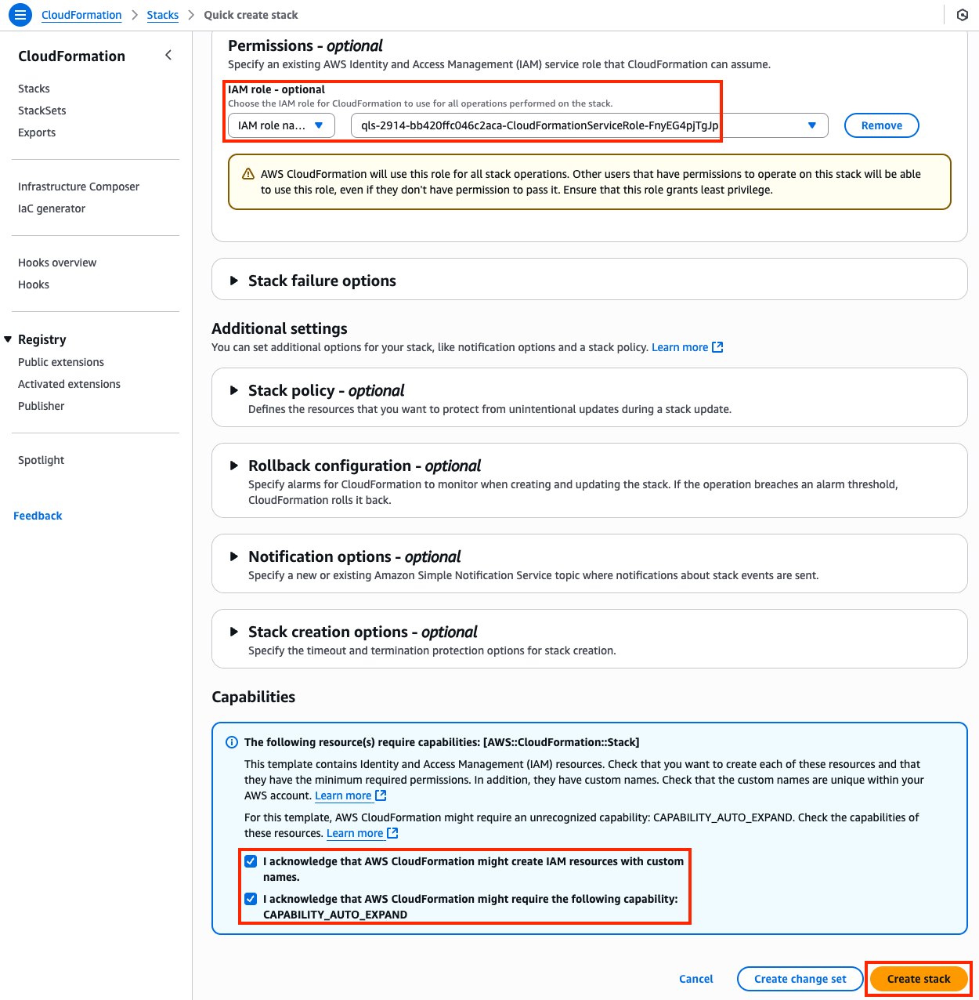

- **0.8:** The CloudFormation stack will take ~20 minutes to finish deploying. Once the main/root CloudFormation stack shows as **Create_Complete**, proceed with the steps below.

    {}

###### 1) Inspect the Cloud WAN attachments and segments

{}

- **1.1:** In the **Network Manager Console** go to the **Global Networks page** (menu on the left), then find and select your Global Network ID.
    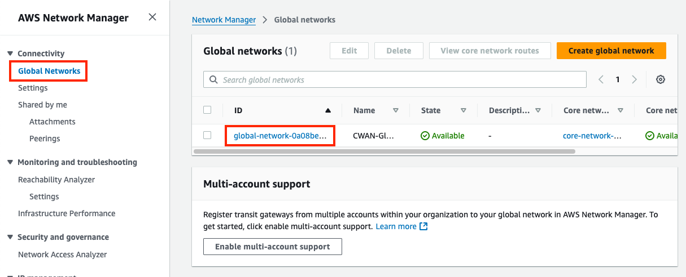
- **1.2:** Once the CWAN Global Network has loaded, go to the **Core network page** (menu on the left), then notice that there are **three segments and one edge location**.
    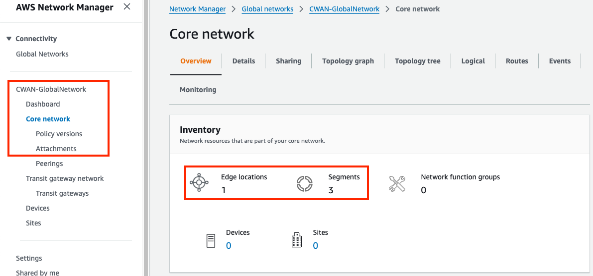
- **1.3:** Scroll down the page and notice the attachments widget shows a total of **5 attachments (4 VPC & 1 Connect)**.
- **1.4:** Navigate to the **attachments page** under your core network. Select the **CWAN-security-connect-attachment** and view the **Details tab** in the pane below, notice the **segment and attachment policy rule number are empty**.
    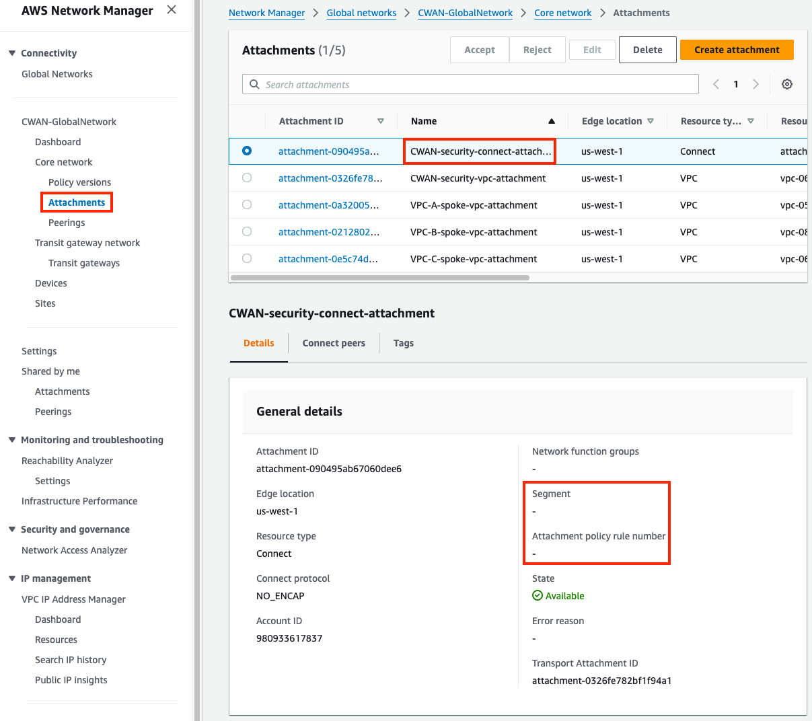
- **1.5:** On the same pane, switch to the **Connect peers tab** and notice the **Peer and Core network BGP 1/2 addresses**. The Peer addresses are the FGT private IPs and Core network are the BGP router endpoints for the Core Network Edge (CNE, ie managed TGW). The **BGP Status may show as down** due to a delay for the console to update the latest values.
    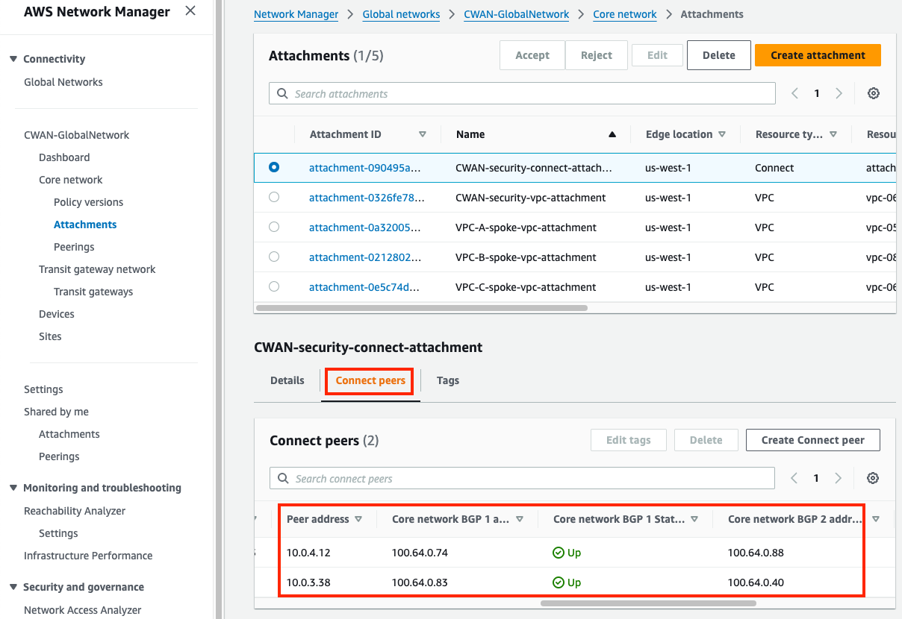
- **1.6:** In the same pane, switch to the **Tags tab** and notice the **segment key and the configured value**. These should match the table below. Select the other attachments to check the tag key value as well.

	Attachment Name | Tag (Key, Value)
	---|---
	CWAN-security-connect-attachment | segment = firewall
	CWAN-security-vpc-attachment | segment = firewall
	VPC-A-spoke-vpc-attachment | segment = production
	VPC-B-spoke-vpc-attachment | segment = production
	VPC-C-spoke-vpc-attachment | segment = development

    {}

###### 2) Review FortiGate1's BGP config and current routes advertised/received

{}

- **2.1:** Navigate to the **CloudFormation Console** and **toggle View Nested to off**.
- **2.2:** Select the main template and select the **Outputs tab**.
- **2.3:** Login to **FortiGate1**, using the outputs **FGT1LoginURL**, **Username**, and **Password**.
- **2.4:** Upon login in the **upper right-hand corner** click on the **>_** icon to open a CLI session.
- **2.5:** Run the command **`get sys int physical port2`** and notice **the interface and IP is private**.
- **2.7:** Run the command **`show router bgp`** and notice the **router-id and BGP peers match the Connect peers information from the previous section**.
- **2.8:** Run the command **`get router info bgp summary`** and notice the **State/PfxRcd values are zero**.
- **2.9:** Run the command **`get router info bgp neighbors <peer-ip> advertised-routes`** for each BGP neighbor and notice **a default route is advertised**.
- **2.10:** Run the command **`get router info bgp neighbors <peer-ip> routes`** for each BGP neighbor and notice **no routes are received from Cloud WAN**.
    {}

###### 3) Update & Apply Core Network Policy

{}

- **3.1:** In the **Network Manager Console** navigate to the **Policy versions page** for your Core Network and select the only policy version and **click Edit**.
    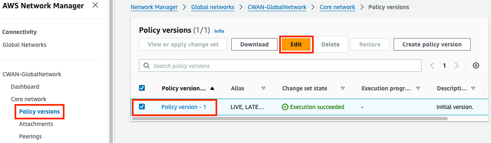
- **3.2:** Select the **Segments tab** and notice the existing segments. You should see **three segments (firewall, production, and development)**.
- **3.3:** Select the **Segments actions tab** then find the **Sharing** section and **click Create**. Use the table below to create the sharing rules need.
    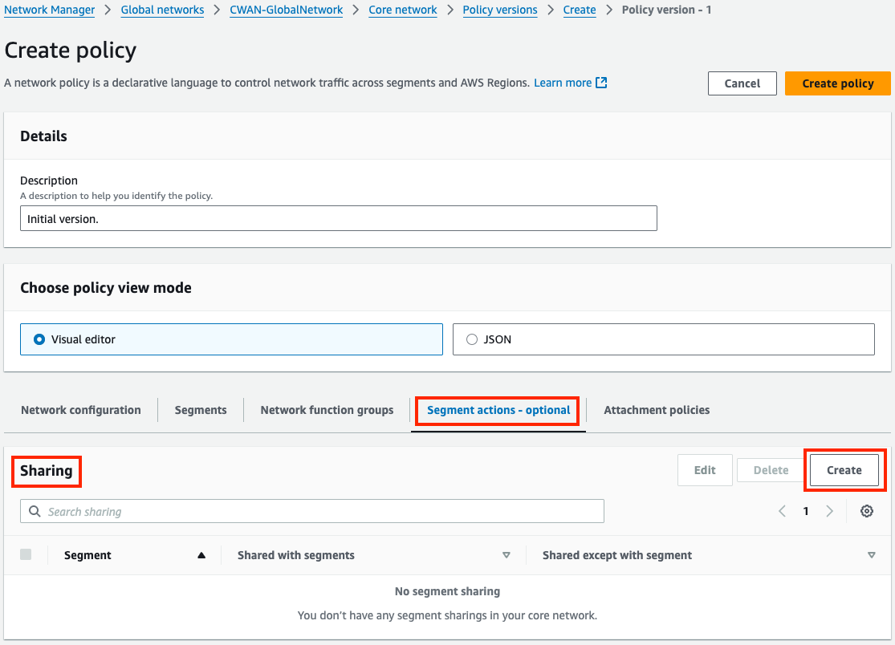

	Segment from | Segment to | Allow segment list
	---|---|---
	production | allow selected | firewall
	development | allow selected | firewall

- **3.4:** Next, select the **Attachment policies tab** then find the **Attachment policies** section and **click Create**. Use the table below to create the sharing rules need. Here is an example of the first rule.
    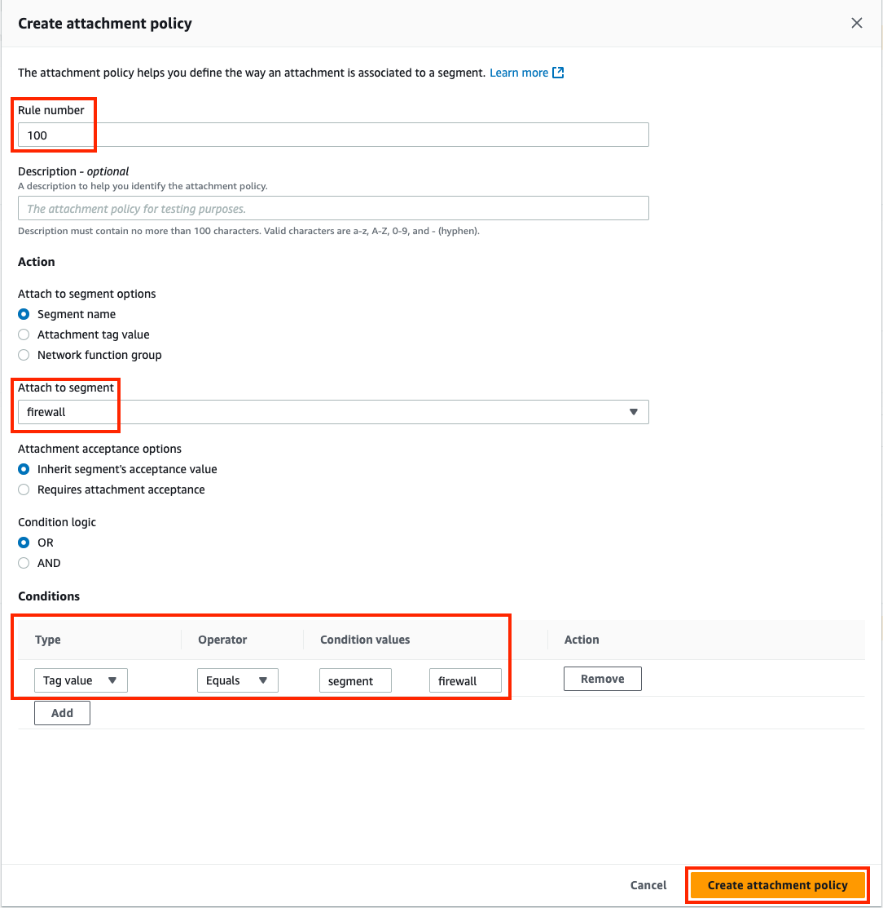

	rule number | Attach to Segment | Conditions Values (Tag Key, Tag Value)
	---|---|---
	100| firewall | Type=Tag Value, Operator=Equals, Condition Values=segment, firewall
	200| production | Type=Tag Value, Operator=Equals, Condition Values=segment, production
	300| development | Type=Tag Value, Operator=Equals, Condition Values=segment, development

- **3.5:** Once completed, you should see these attachment policies. Next, **click Create policy**.
    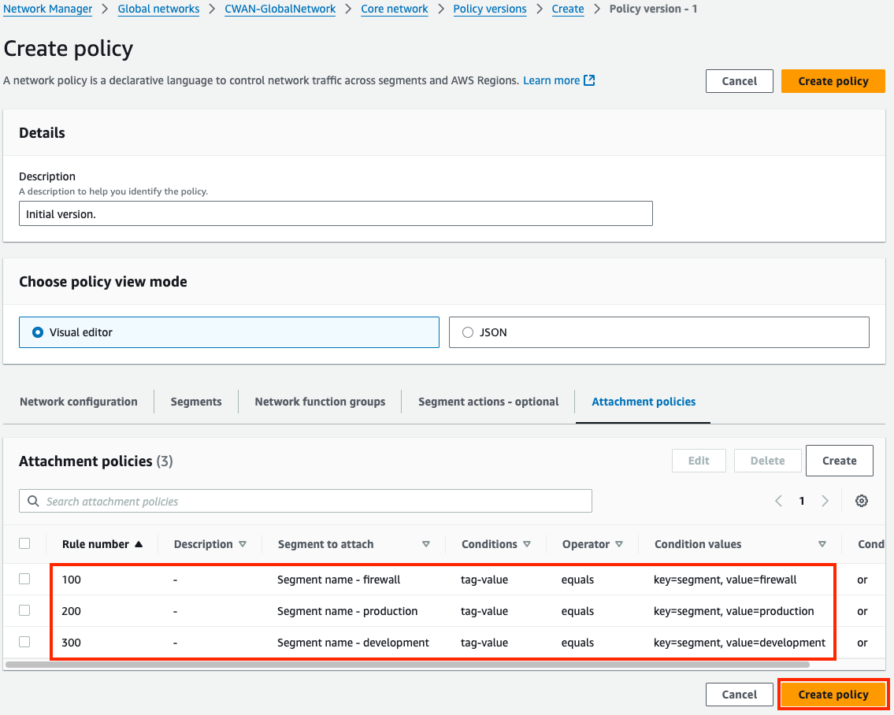
- **3.6:** You should be back on the **Policy versions page** with a new policy version showing. Once **Policy version - 2 shows Ready to execute**, select the version and **click View or apply change set**.
     
- **3.7:** On the **next page click Apply change set**. You will be returned to the Policy version page and see the **new policy version is executing**. In a few moments this will show as **Execution succeeded**.
     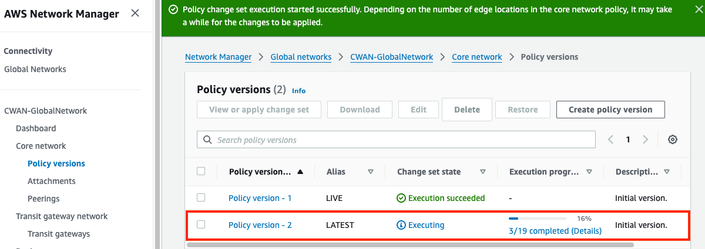
     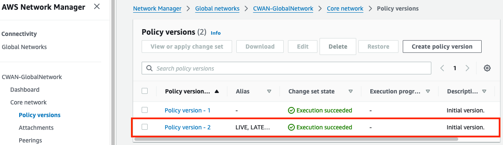

    {}

###### 4) Test traffic and Validate Results

{}

- **4.1:** Navigate to the **attachments page** under your Core Network. Select the **CWAN-security-connect-attachment** and view the **Details tab**. Notice the **segment and attachment policy rule number are now populated**. The table below should match what your environment looks like after applying the correct Core Network Policy. Select the other attachments to verify the results.

	Attachment | Segment | Rule
	---|---|---
	CWAN-security-connect-attachment | firewall | 100
	CWAN-security-vpc-attachment | firewall | 100
	VPC-A-spoke-vpc-attachment | production | 200
	VPC-B-spoke-vpc-attachment | production | 200
	VPC-C-spoke-vpc-attachment | development | 300
	
	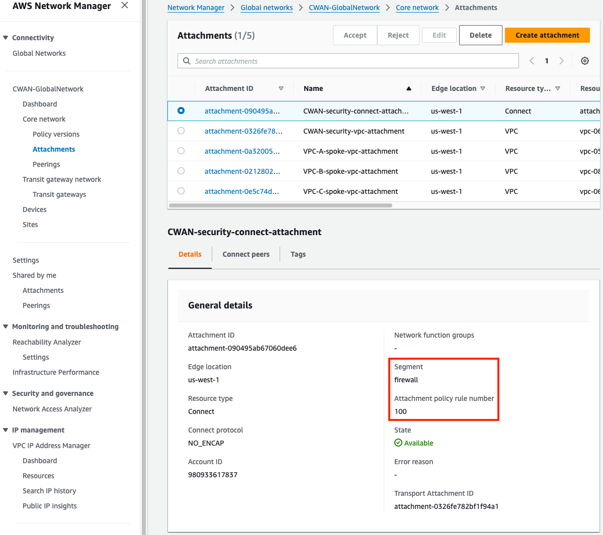

- **4.2:** Navigate to the **main Core network page** for your Core Network. Select the **Routes tab** and in the route filter, **select a segment and edge location and click Search routes**. You should eventually see routes matching the table below. Notice, the default route is an **ECMP route received from both FGTs through the connect attachment**.

	Segment | CIDRs
	---|---
	firewall | 10.0.0.0/16 (Sec-VPC), 10.1.0.0/16 (VPC-A), 10.2.0.0/16 (VPC-B), 10.3.0.0/16 (VPC-C), 0.0.0.0/0 (Sec-Connect)
	production | 10.0.0.0/16 (Sec-VPC), 10.1.0.0/16 (VPC-A), 10.2.0.0/16 (VPC-B), 0.0.0.0/0 (Sec-Connect)
	development | 10.0.0.0/16 (Sec-VPC), 10.3.0.0/16 (VPC-C), 0.0.0.0/0 (Sec-Connect)

	

- **4.2:** Login to **FortiGate1**, using the outputs **FGT1LoginURL**, **Username**, and **Password**.
- **4.4:** Upon login in the **upper right-hand corner** click on the **>_** icon to open a CLI session.
- **4.8:** Run the command **`get router info bgp summary`** and notice **State/PfxRcd is now showing four routes received**.
- **4.9:** Run the command **`get router info bgp neighbors <peer-ip> routes`** for each BGP neighbor and notice **four routes are received from Cloud WAN**. Notice that the **Next Hop address** is the IP of the Core Network attachment **CWAN-security-vpc-attachment** in the same subnet as port2 of FortiGate1.
- **4.10:** Run the command **`get router info routing-table all`** and notice there is **a static route for 100.64.0.0/24 & 10.0.0.0/16 out port2**. This allows the FGTs to BGP directly with the Core Network Edge (CNE) and use FGSP between each FGT.
- **4.11:** Navigate to the **EC2 Console** and connect to **Instance-A** using the **[Serial Console directions](../3_modulethree.html)** 
    - Password: **`FORTInet123!`**
- **4.12:** Run the following commands to test connectivity and make sure the results match expectations 
  SRC / DST | VPC B | VPC C 
  ---|---|---
  **Instance A** | **`curl 10.2.2.10`**  | **`curl 10.3.2.10`** 
  **Instance A** | **`ping 10.2.2.10`**  | **`ping 10.3.2.10`** 

    {}

###### 5) Let's dig deeper to understand how all of this works

{}

- **5.1** Notice that Instance-A can access Instance-B over HTTP but could not access Instance-C, however pings were successful. This is because Instance-A and Instance-B are in VPCs attached to the production segment which is configured as a shared routing domain by default. This allows anything attached to the same segment to communicate bidirectionally. This means anything in VPC A can reach VPC B without being sent through the FGTs in the inspection VPC which is in the firewall segment.
- **5.2** VPC C is in the development segment so when VPC A reaches out to this destination, the routes for the production segment first forwards traffic to the FGTs in the inspection VPC (via 0.0.0.0/0 to Connect attachments). This allowed the FGTs to enforce FW policy that blocked HTTP access from VPC A to VPC C but allowed pings between the different segments.
- **5.3** Segments can be configured to be isolated so that resources attached to the same segment can't communicate directly. Through the Core Network Policy you can still allow access to specific routes or other segments explicitly.
- **5.4** In the **Network Manager Console** navigate to the **Policy versions page** select **'Policy version - 2' and click Edit**.
- **5.5** Select the **Segments tab**, select the **production segment and click Edit**.
- **5.6** On the **Edit segment page**, check the box for **Isolated attachments and click Edit Segment**, then on the next page **click Create Policy**.
	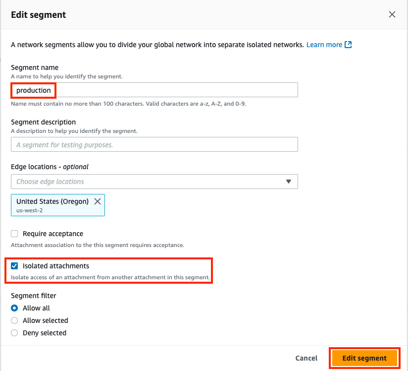
- **5.7** You should be back on the **Policy versions page** with a new policy version showing. Once **Policy version - 3 shows Ready to execute**, select the version and **click View or apply change set**.
- **5.8** On the **next page click Apply change set**. You will be returned to the Policy version page and see the **new policy version is executing**. In a few moments this will show as **Execution succeeded**.
- **5.9:** Navigate back to the **EC2 Console** and connect to **Instance-A** using the **[Serial Console directions](../3_modulethree.html)** 
	- Password: **`FORTInet123!`**
- **5.10:** Run the following commands to test connectivity again and make sure the results match expectations 
  SRC / DST | VPC B | VPC C 
  ---|---|---
  **Instance A** | **`curl 10.2.2.10`**  | **`curl 10.3.2.10`** 
  **Instance A** | **`ping 10.2.2.10`**  | **`ping 10.3.2.10`** 
  - HTTP should now be block by the FW policy on the FGTs for VPC B and C but Pings allowed

- **5.11** Navigate back to the **main Core network page** for your Core Network. Select the **Routes tab** and in the route filter, **select the production segment and edge location and click Search routes**. You should eventually see routes matching the table below. **The production segment now does not automatically share routes for attachments**.

	Segment | CIDRs
	---|---
	firewall | 10.0.0.0/16 (Sec-VPC), 10.1.0.0/16 (VPC-A), 10.2.0.0/16 (VPC-B), 10.3.0.0/16 (VPC-C), 0.0.0.0/0 (Sec-Connect)
	production | 10.0.0.0/16 (Sec-VPC), 0.0.0.0/0 (Sec-Connect)
	development | 10.0.0.0/16 (Sec-VPC), 10.3.0.0/16 (VPC-C), 0.0.0.0/0 (Sec-Connect)

  {}

  At this point, all East/West and egress traffic is being sent through the FGTs in the Inspection VPC, even for VPC A to VPC B traffic which are in the same segment. The FGTs in this design are independent but use FGSP (FortiGate Session Life Support Protocol) to synchronize sessions between each other. In this design each FGT is actively handling traffic from Cloud WAN which means that at some point there will be asymmetric traffic flows since TGWs, CNEs, etc are stateless routers. Thus, FGSP is used to keep each FGT aware of each other's sessions.
  
  To view synchronized sessions, generate more PING traffic from Instance A and **run the commands below on both FGTs**. When a session entry is created on the current FGT the **synced** session state flag is set. When a session entry is received from another FGT the **syn_ses** session state flag is set. Notice this when running the commands below on each FGT.

	diag sys session filter proto 1
	diag sys session list | grep -c 'syn_ses'
	diag sys session list | grep -c 'synced'
	diag sys session list
	get sys int physical port2
	show system standalone-cluster
	diag sys ha standalone-peers
	diag sys session sync
	

  While FGSP is great, there are caveats to keep in mind such as: inspecting asymmetric traffic with NGFW L7 features, increased packets per second (PPS) rates due to FGSP can trigger throttling from cloud providers, etc. To find out more about FGSP reference this  [**documentation**](https://docs.fortinet.com/document/fortigate/7.6.3/administration-guide/668583/fgsp).

  [**Appliance Mode**](https://docs.aws.amazon.com/vpc/latest/tgw/transit-gateway-appliance-scenario.html) is not required but recommended if FGSP is to be used as it limits the amount of asymmetric traffic that will be handled in an ECMP Active-Active design. Appliance mode will use a flow hash algorithm to send traffic, including reply traffic, for the life of the flow to the same availability zone and network interface of the attachment within the appliance or inspection VPC.
  {}

    {}

###### 6. Lab environment teardown

{}

- **6.1:** Navigate to the **CloudFormation Console**, select the main stack you created and click **Delete**.
- **6.2:** The CloudFormation stack will take ~20 minutes to clean up. Once the stack is deleted, take a long break :smile:, you deserve it!

    {}

## Discussion Points
- Cloud WAN (CWAN) is a global service
  - Network Manager Console, Global Network, and Core Network Policy are global
  - Segments are global, but connected resouces such as CNE locations and attachments are regional
  - Core Network Edge (CNEs), and attachments (VPC, Connect, VPN, Direct Connect, etc) are regional
- Segments are dedicated routing domains that can be isolated or allow direct communication between attached resources
- Core Network Edges (CNEs) are essentially managed TGWs which are peered together with BGP
- Core Network Policy allows granular automation of attachment association, propagation, and sharing of other routes between segments
- CWAN supports ECMP routing with routes from the same attachment type
   - CWAN is a stateless router which will result in asymmetric routing of traffic
   - SNAT is required for flow symmetry to the correct FortiGate in Active-Active design
   - FGSP can be used instead of SNAT for Active-Active East/West inspection with caveats
   - [**Appliance Mode**](https://docs.aws.amazon.com/vpc/latest/tgw/transit-gateway-appliance-scenario.html) is not required but recommended as it limits the amount of asymmetric traffic
- Connect (tunnel-less) attachments use BGP directly to privately connect to an appliance within a VPC only (ie no overlay tunnel IPsec or GRE needed)
- Each CWAN Connect (tunnel-less) peer supports up to 100 Gbps, (actual limit is based on instance type BW)
- Jumbo frames (8500 bytes) are supported for all attachments except VPN (1500 bytes)

{}
Once completed with this task, complete the quiz below as an individual whenever you are ready. **This quiz is scored and tracked individually.**
{}





**This concludes this task**
