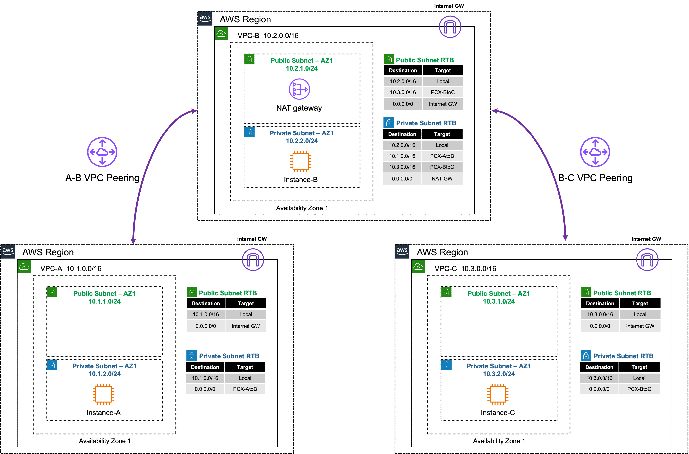
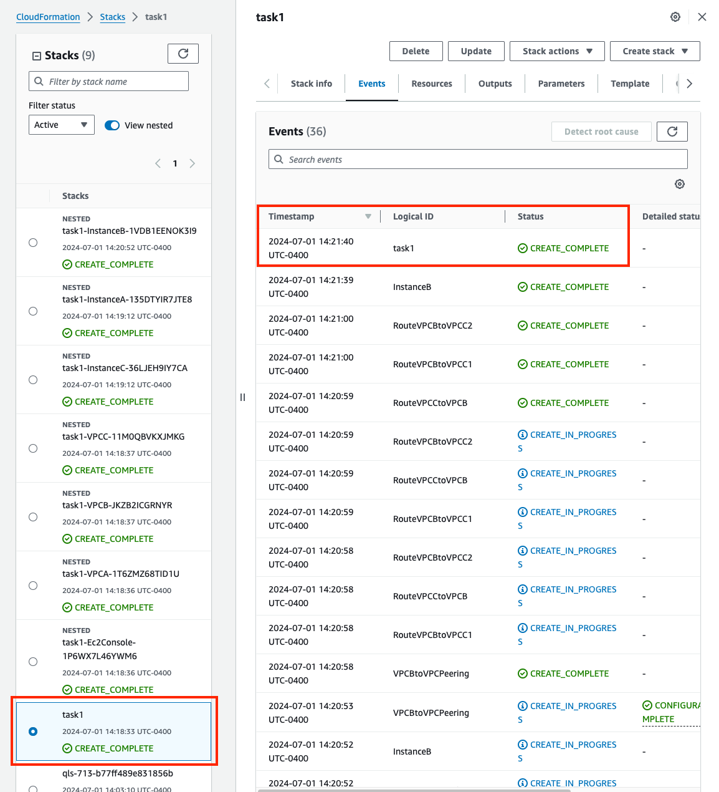
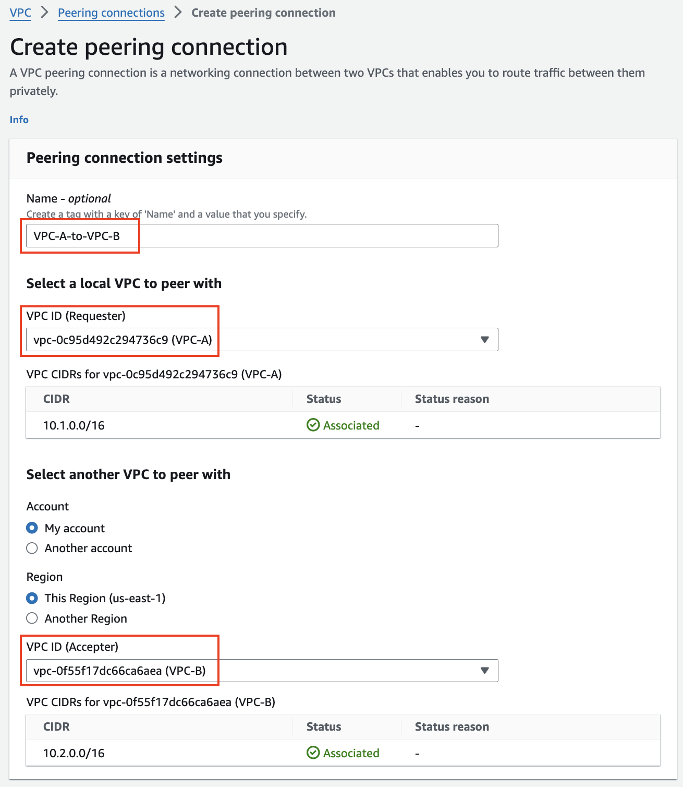
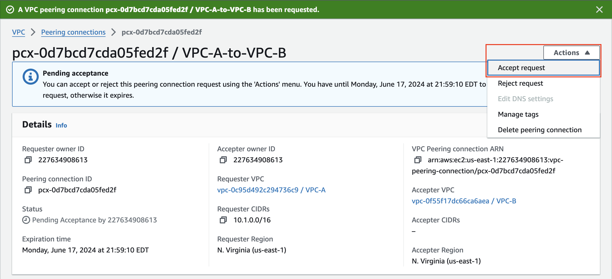
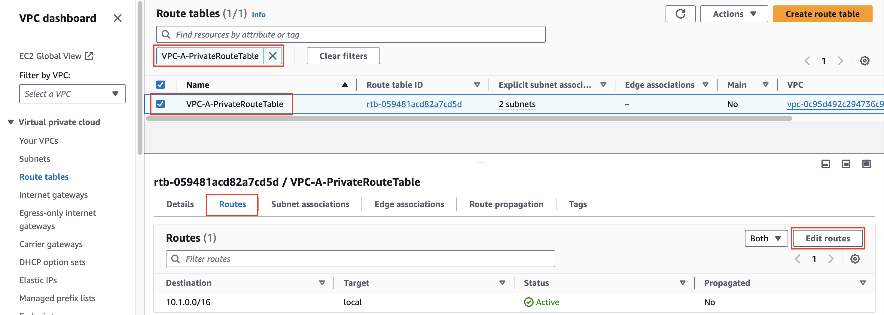
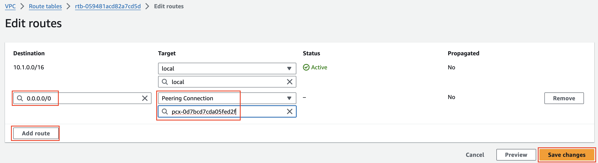

|      |    |  
|:----:|:---|
| **Goal**                   | Establish point to point access from VPC A to VPC B
| **Task**                   | Create a peering connection and VPC routes so EC2 Instance-A can ping Instance-B
| **Validation** | Confirm point to point VPC connectivity with ping from EC2 Instance-A to B and Instance-B to C

## Introduction 

In this task, there are multiple VPCs in the same region that have one instance each. VPC peering and the appropriate VPC routes are already configured for VPC-B to VPC-C. VPC peering and VPC routes will need to be configured between VPC-A and VPC-B. Then traffic will be tested to confirm what traffic routing is and is not supported with VPC peering.

{} 
There are no security controls in this example. Instance-B can freely communicate with the Internet.
{}

## Summarized Steps (click to expand each for details)

###### 0) Lab environment setup

{}

- **0.1:** Login to your AWS account, and click this **Launch Stack** button to Launch the CloudFormation Stack for Task 1
  
  

- **0.2:** **You must:** 
    - **select an IAM role in the Permissions section**
	- **check the boxes to acknowledge the warnings in the Capabilities section**
	- then scroll down and click **Create stack**

{}
**If you do not select a the IAM role and continue with stack creation, this will fail!** If this occurred, simply create another stack with a different name and follow the steps closely for this section. 
{}
  
  

- **0.3:** Once the main/root CloudFormation stack shows as **Create_Complete**, proceed with the steps below.

  

    {}

###### 1) Find EC2 Instance-A and verify it can't access Instance-B or C

{}

- **1.1:** In your AWS account, navigate to the **EC2 Console** and go to the **Instances page** (menu on the left).
- **1.2:** Find **Instance-A** and connect to it using the **[Serial Console directions](../3_modulethree.html)** 
    - Password: **`FORTInet123!`**
- **1.3:** Run the following commands to test connectivity and make sure the results match expectations 
  SRC / DST | VPC B                                                   | VPC C
  ---|--------------------------------------------------------------|---
  **Instance A** | **`ping 10.2.2.10`**  |  **`ping 10.3.2.10`** 
  **Instance A** | **`curl ipinfo.io`**  |

- **1.4:** Run the command **`ifconfig ens5`** and take note of the instance IPv4 address.
- **1.5:** Run the command **`route -n`** and take note of the default route and the gateway IP for that route.

  {}

  The instance has a default route going to the private IP of 10.1.2.1. This is the AWS VPC router (aka intrinsic router), which is the first host IP in any subnet within a VPC. Reference this [**AWS document**](https://docs.aws.amazon.com/vpc/latest/userguide/subnet-sizing.html#subnet-sizing-ipv4) to learn what other IPs in a subnet are always used by AWS.

  {}
  
    {}

###### 2) Create a VPC peering connection and VPC routes to allow Instance-A in VPC-A to reach Instance-B in VPC-B

{}

- **2.1:** Navigate to the **VPC Console** and go to the **Peering connections page** (menu on the left) and click **Create peering connection**.
- **2.2:** Provide a name then select **VPC-A as the requester** and **VPC-B as the Accepter** and click **Create peering connection** at the bottom of the page.
- **2.3:** On the next page, click **Action** and select **Accept Request**, and again on the pop-up window.
- **2.4:** Go to the **VPC Route tables page** and find **VPC-A-PrivateRouteTable** , select the **Routes tab** and click **Edit Routes**.
- **2.5:** Create a route for **0.0.0.0/0** with the peering connection as your target.
- **2.6:** Repeat the same steps above to create a route for **10.1.0.0/16** in **VPC-B-PrivateRouteTable** to allow reply traffic.
  
  
  
  

  {}

###### 3) Verify communication over the VPC Peering connection

{}

- **3.1:** Navigate to the **EC2 Console** and connect to **Instance-A** using the **[Serial Console directions](../3_modulethree.html)** 
    - Password: **`FORTInet123!`**
  
- **3.2:** Run the following commands to verify connectivity and make sure results match expectations
  SRC / DST | VPC B                                                   | VPC C | Internet
  ---|--------------------------------------------------------------|---|---
  **Instance A** | **`ping 10.2.2.10`**  |  **`ping 10.3.2.10`** 
  **Instance A** | | | **`curl ipinfo.io`** 

   - Now you can successfully ping Instance-B over the peering connection.
   - Instance-A **SHOULD NOT** be able to ping Instance-C or access the Internet through VPC-B.
  
    {}

###### 4) Let's dig deeper to understand how VPC Peering works

{}

   {}
   - VPC Peering permits point to point connectivity between **instances in 2 directly peered VPC's** and nothing else
   - Transitive peering or peering from **VPC A _through_ VPC B to VPC C** is not permitted
   - Accessing AWS Services (like NAT or Internet GW) via a peering connection does not work
   {}

- **4.1:** In the **EC2 Console** go to the **Instances page** connect to **Instance-B** using the **[Serial Console directions](../3_modulethree.html)** 
    - Password: **`FORTInet123!`**
- **4.2:** Run the following commands to verify connectivity and make sure results match expectations
SRC / DST | Instance A                                                   | Instance C | Internet
  ---|--------------------------------------------------------------|---|---
  **Instance B** | **`ping 10.1.2.10`**    |  **`ping 10.3.2.10`** 
  **Instance B** | | | **`curl ipinfo.io`**  

- **4.3:** In the **EC2 Console** go to the **Instances page** connect to **Instance-C** using the **[Serial Console directions](../3_modulethree.html)** 
    - Password: **`FORTInet123!`**
- **4.4:** Run the following commands to verify connectivity and make sure results match expectations
SRC / DST | Instance A                                                   | Instance B | Internet
  ---|--------------------------------------------------------------|---|---
  **Instance C** | **`ping 10.1.2.10`**   |  **`ping 10.2.2.10`** 
  **Instance C** | | | **`curl ipinfo.io`** 

   - Instance-C should ping Instance-B but not be able to ping Instance-A or access the internet through VPC-B.
  {}

  The VPC peering connection is at the **VPC level**. This means the VPC peering connection is not directly tied to any VPC subnet or route table explicitly. AWS routing will only deliver traffic to an IP address that is within the destination VPC CIDR. The routes you created in both VPC-A and B's private route tables only direct traffic out of the local VPC to the target destination VPC. Reference this [**AWS documentation**](https://docs.aws.amazon.com/vpc/latest/peering/vpc-peering-basics.html#vpc-peering-limitations) to learn more about the limitations of VPC Peering.
    
  {}

- **4.5** Below is a step by step of the packet handling for the traffic from Instance-A to Instance-B.

Hop | Component | Description | Packet |
---|---|---|---|
1 | Instance-A -> 0.0.0.0/0 PCX | Outbound traffic destined to Instance-B is sent to the VPC router (its default gw) which routes traffic to the VPC peering connection as configured in the VPC-A-PrivateRouteTable. | **10.1.2.10:src-port -> 10.2.2.10:dst-port** |
2 | VPC Router -> Instance-B | Inbound traffic leaves the VPC peering connection and is sent to the VPC router which delivers traffic directly to Instance-B. | **10.1.2.10:src-port -> 10.2.2.10:dst-port** |
3 | Instance-B -> 10.1.0.0/16 PCX | Instance-B receives the traffic, seeing the original private source IP, and replies. This traffic is sent to the VPC router (its default gw) which routes the traffic to the VPC peering connection as configured in the VPC-B-PrivateRouteTable. | **10.2.2.10:src-port -> 10.1.2.10:dst-port** |
4 | VPC Router -> Instance-A | Response traffic leaves the VPC peering connection and is sent to the VPC router which delivers traffic directly to Instance-A. | **10.2.2.10:src-port -> 10.1.2.10:dst-port** |
  
  {}

  When Instance-A attempts to ping Instance-C or access the Internet through VPC-B (using the default route), the VPC router at step 2 above would drop the traffic as the destination does not match the CIDR of VPC-B.
    
  {}

  

- **4.6** Below is a step by step of the packet handling for the traffic from Instance-B to the internet.

Hop | Component | Description                                                                                                                                                               | Packet |
---|---|---------------------------------------------------------------------------------------------------------------------------------------------------------------------------|---|
1 | Instance-B -> 0.0.0.0/0 NAT GW | Instance-B sends outbound traffic to the VPC router (it's default gw) which routes the traffic to NAT GW as configured in the VPC-B-PrivateRouteTable.                    | **10.2.2.10:src-port -> x.x.x.x:80** |
2 | NAT GW -> 0.0.0.0/0 IGW | NAT GW changes the source IP to its own private IP and sends the traffic to VPC router. The VPC router routes traffic to IGW as configured in the VPC-B-PublicRouteTable. | **y.y.y.y:src-port -> x.x.x.x:80** |
3 | IGW -> Internet | IGW changes the source IP to the associated EIP of NAT GW and routes the traffic to the internet.                                                                         | **z.z.z.z:src-port -> x.x.x.x:80** |
4 | Internet -> IGW | IGW receives reply traffic, changes the DEST IP to the private IP of NAT GW, and sends the traffic to VPC router. The VPC router routes traffic to the NAT GW.            | **x.x.x.x:80 -> y.y.y.y:dst-port** |
5 | NAT GW -> Instance-B | NAT GW changes the DEST IP back to the private IP of Instance-B and routes the traffic to the VPC router which delivers the traffic to Instance-B.                        | **x.x.x.x:80 -> 10.2.2.10:dst-port** |

  
  
  {}

###### 5) Lab environment teardown

{}

- **5.1:** Before deleting the main CloudFormation Stack, we must remove the VPC routes referencing the VPC peering connection, and the VPC peering connection itself.
- **5.2:** Navigate to the **VPC Console** and go to the **Peering connections page** (menu on the left), select the peering for VPC-A to B and click **Actions**, then select **Delete peering connection**. This will **prompt you to delete the related route table entries**. Select **Delete related route table entries**, then to confirm, type **delete** in the field and click **Delete**.
- **5.3:** Navigate to the **CloudFormation Console**, select the main stack you created and click **Delete**.
- **5.4:** Once the stack is deleted, proceed to the next task.

    {}

## Discussion Points
- VPC peering is a point to point connection only (no transitive routing).
- Full mesh is required to connect all VPCs together. 
  - For example connecting 10 VPCs would require (10*9)/2 = 45 connections.
- VPC peering supports connections between VPCs:
  - In the same or different AWS Accounts
  - In the same (intra) or across (inter) regions
- When using inter-region peering, encryption is used.
- No Internet Gateway is required for VPC Peering (even when inter-region)
- Jumbo frames (9001 bytes) are only supported for intra-region connections, inter-region is limited to 1500 bytes.

**This concludes this task**
