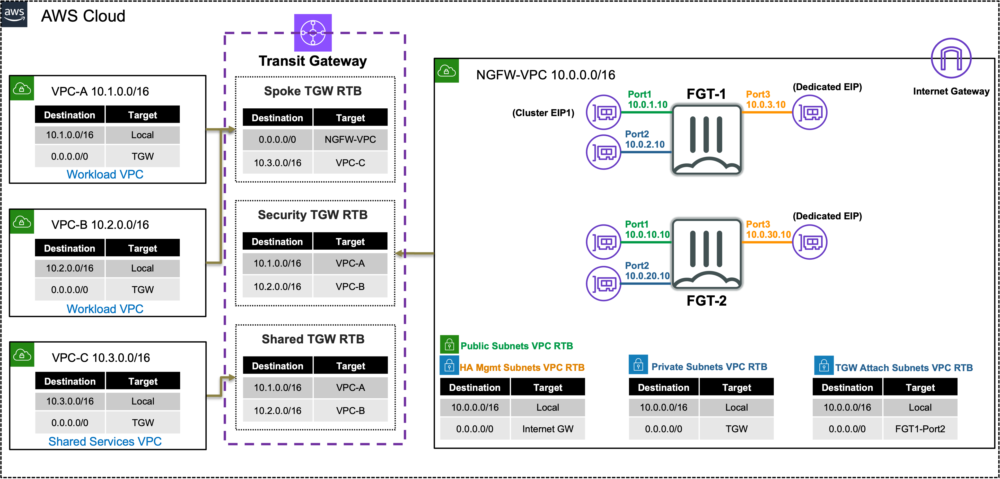
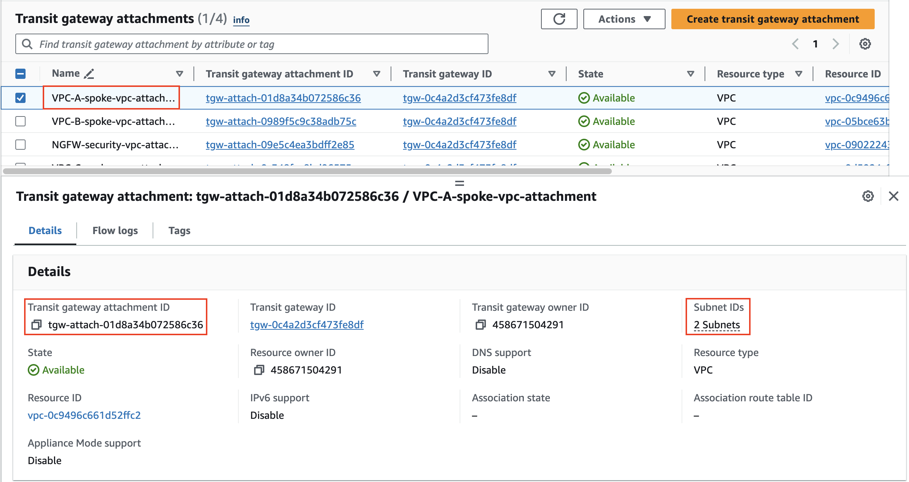
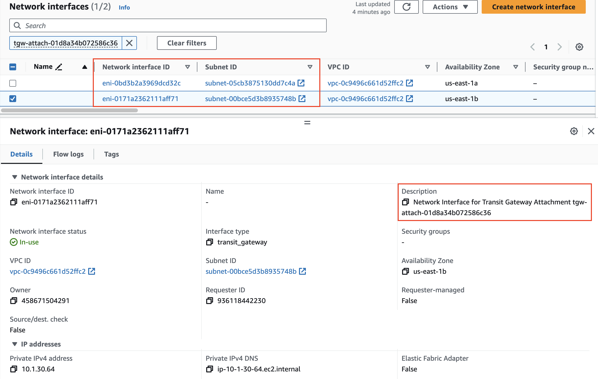
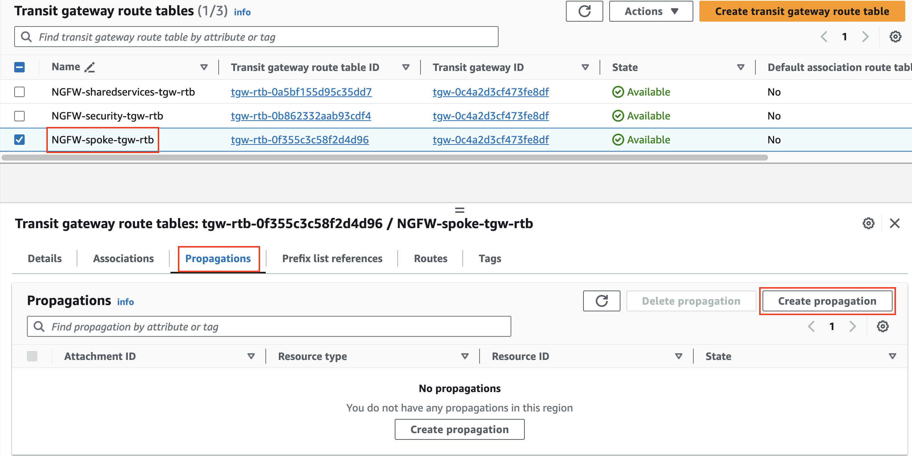
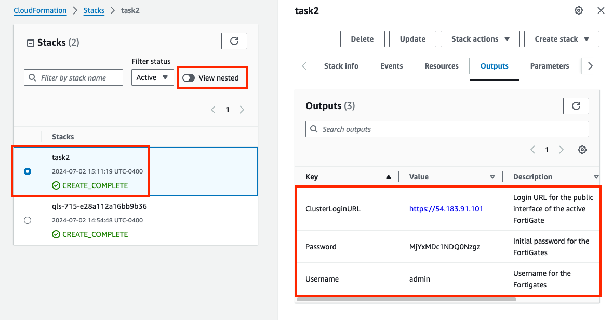
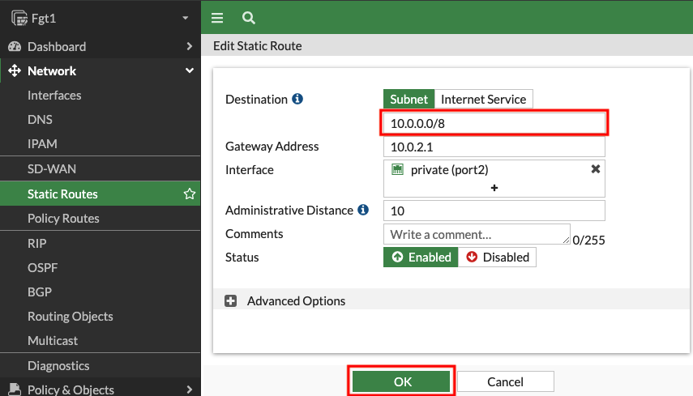
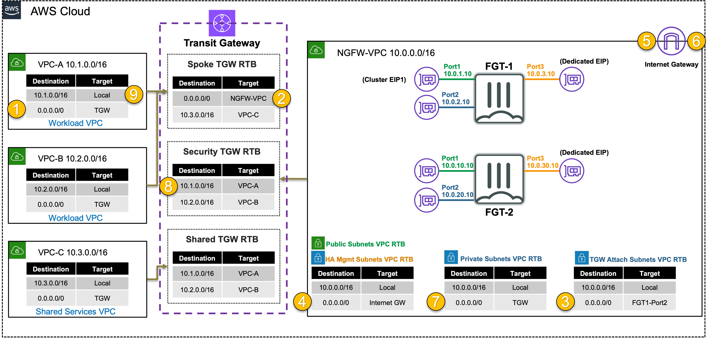

|                            |    |  
|:----------------------------:|:----
| **Goal**                   | Establish open, secured east/west (Inter-VPC), and outbound flows through the provisioned NGFW VPC and Transit gateway architecture.
| **Task**                   | Create attachment associations + propagations and configure FortiGate routes and firewall policy to allow secured traffic.
| **Validation** | Confirm outbound and east/west connectivity from EC2 Instance-A via Ping, HTTP, HTTPS.

## Introduction

In this task, there are multiple VPCs in the same region that have one instance each. Transit Gateway (TGW) is configured with multiple Transit Gateway Route Tables.  You will need to create the appropriate VPC attachment associations and propagations to the correct TGW Route Tables, FW policy and update a static route on the FortiGate Active-Passive cluster.

In this scenario you will allow traffic between the workload and shared services VPC to communicate directly (without going through the FortiGate A-P cluster), while inspecting outbound and east/west connectivity with the workload VPCs.

## Summarized Steps (click to expand each for details)

###### 0) Lab environment setup

{}

- **0.1:** Login to your AWS account, and click the **Launch Stack** button below to launch the CloudFormation stack for Task 2

- **0.2:** **You must:** 
    - **select an IAM role in the Permissions section**
	- **check the boxes to acknowledge the warnings in the Capabilities section**
	- then scroll down and click **Create stack**

{}
**If you do not select a the IAM role and continue with stack creation, this will fail!** If this occurred, simply create another stack with a different name and follow the steps closely for this section. 
{}
  
  

- **0.3:** The CloudFormation stack will take ~10 minutes to finish deploying. Once the main/root CloudFormation stack shows as **Create_Complete**, proceed with the steps below.

    {}

###### 1) Inspect the Transit Gateway VPC attachments

{}

- **1.1:** In the **VPC Console** go to the **Transit gateway attachments page** (menu on the left), then find and select the **VPC-A-spoke-vpc-attachment** attachment.
- **1.2:** On the **Details tab**, click **2 Subnets** under Subnet IDs.
  
- **1.3:** Copy the **Transit gateway attachment ID** and navigate to the **EC2 Console**.
- **1.4:** On the **Network Interfaces page**, paste the attachment ID into the search field and find the two interfaces.
  

  {}
Notice that the VPC attachment is associated or attached to two subnets in VPC-A. This means VPC route tables can be used to direct traffic that comes through the attachment. This is what allows transitive routing to occur.    
  {}

   {}

###### 2) Create associations and propagations for VPC attachments to Transit Gateway Route Tables for east/west to shared services

{}

- **2.1:** Navigate to the **VPC Console** and go to the **Transit gateway route tables page** (menu on the left).
- **2.2:** Each tgw-rtb has an **associations** and **propagations** tab.
  
  
- **2.3:** Use the table below to create the associations and propagations to setup the environment for general east/west between VPC-A and VPC-B to VPC-C.

TGW-RTB Name | Associations | Propagations | 
---|---|---
NGFW-security-tgw-rtb | NGFW-security-vpc-attachment | VPC-A-spoke-vpc-attachment <b>and</b>  VPC-B-spoke-vpc-attachment
NGFW-spoke-tgw-rtb | VPC-A-spoke-vpc-attachment <b>and</b>  VPC-B-spoke-vpc-attachment | VPC-C-spoke-vpc-attachment
NGFW-sharedservices-tgw-rtb | VPC-C-spoke-vpc-attachment | VPC-A-spoke-vpc-attachment <b>and</b>  VPC-B-spoke-vpc-attachment

    {}

###### 3) Create a default route for centralized east/west and outbound through an inspection VPC

{}

- **3.1:** In the **VPC Console** and go to the **Transit gateway route tables page** (menu on the left).
- **3.2:** Select **NGFW-spoke-tgw-rtb**, select the **routes tab** and click **Create static route**.
- **3.3:** Create a route for **0.0.0.0/0** and the **NGFW-security-vpc-attachment** attachment.

   {}

###### 4) Login to the FortiGate GUI, modify a route and add a Firewall Policy allowing east/west

{}

- **4.1:** Navigate to the **CloudFormation Console** and **toggle View Nested to off**.
- **4.2:** Select the main template and select the **Outputs tab**.
- **4.3:** Login to the FortiGate GUI, using the outputs **ClusterLoginURL**, **Username**, and **Password**.
  
- **4.4:** Upon login, navigate to **Network > Static Routes**.
- **4.5:** Edit the existing route to **10.0.0.0/16**.
  - This route needs to be updated to allow access to both the Spoke VPCs that are part of this centralized design. Change the destination to **10.0.0.0/8** and click **OK** to save the change.

{}
Since these FortiGates are in separate availability zones and subnets, the gateway IP address will be different for each FortiGate. Thus, there are exceptions for what configuration can be synchronized such as interface settings and static routes. In production you would need to log into the secondary FortiGate and repeat this step to update the static route so traffic handling is the same after a failover.
{}

- **4.6:** Navigate to **Policy & Objects > Firewall Policy** and click **Use new layout when prompted**, then click **Create new**. 

{}
If you accidentally did not use the new layout, you can change it by clicking on **Classic Layout** in the top right and switch to **Use new layout**.
{}

- **4.7:** Create a new policy with the **settings shown below** and click **OK** to allow east/west ICMP.

   {}

###### 5) Test open east/west connectivity from Instance-A to Instance-C in shared services

{}

- **5.1:** Navigate to the **EC2 Console** and connect to **Instance-A** and/or **Instance-B** using the **[Serial Console directions](../3_modulethree.html)** 
    - Password: **`FORTInet123!`** 
- **5.2:** Run the following commands to test connectivity and make sure the results match expectations 
  SRC / DST | VPC C (Shared Services)
  ---|----
  **Instance A** | **`ping 10.3.2.10`** 
  **Instance A** | **`curl 10.3.2.10`** 
  **Instance B** | **`ping 10.3.2.10`** 
  **Instance B** | **`curl 10.3.2.10`** 

{}
Due to the configuration of the Transit gateway route tables, the east/west traffic between VPC-A and VPC-B to VPC-C is not being routed through the inspection VPC. That is why you are able to allow HTTP, SSH, and other traffic between these VPCs. While this may be acceptable for trusted and low security risk environments, it is best practice to have clear visibility and control on what communication is allowed by routing this through a security stack.
{}

   {}

###### 6) Test secured east/west and outbound connectivity from Instance-A to Instance-B

{}

- **6.1:** While still in the console session for Instance-A, Run the following commands to test connectivity and make sure the results match expectations 
  
  SRC / DST | VPC B                               | Internet
  --- |-------------------------------------| ---
  **Instance A** | **`ping 10.2.2.10`**   | **`ping 8.8.8.8`**  
  **Instance A** | **`curl 10.2.2.10`**      | **`curl ipinfo.io`** 
  **Instance A** | ---                                 | **`curl -k https://ipinfo.io`** 
  **Instance A** | ---                                 | **`curl -k --retry 2 --retry-all-errors https://secure.eicar.org/eicar.com.txt -o file.txt`** 
  
  - A --> B succeeded for ping but not HTTP due to FortiGate Firewall Policy
  - A --> Internet was successful for PING, Web Filtered for HTTPS, and blocked for HTTP due to FortiGate Firewall Policy
  
- **6.2:** To check the content of the file from the last command, run the command **`cat file.txt | grep -A 15 'High Security Alert'`**.
  - You will see you were blocked, and a block page was returned due to the **Web Filtering** profile

{}
Due to the configuration of the Transit gateway route tables, the east/west traffic from VPC-A to VPC-B and both VPCs to the internet is being routed through the inspection VPC. This is allowing us to have better visibility and control from both a layer 4 and 7 perspective. This allows us to trust but verify what is allowed and occurring in our environment.
{}

   {}

###### 7) Let's dig deeper to understand how all of this works

{}

{}	
[**Transit Gateway (TGW)**](https://docs.aws.amazon.com/vpc/latest/tgw/how-transit-gateways-work.html) is a highly scalable cloud router that connects your VPCs in the same region to each other, to on-premise networks, and even to the internet through one hub. With the use of multiple route tables for a single TGW, you can design hub and spoke routing for traffic inspection and enforcement of security policy across multiple VPCs. As the name implies, [**Transit Gateway supports transitive routing**](https://docs.aws.amazon.com/vpc/latest/tgw/TGW_Scenarios.html).

In this section, we used Transit gateway to provide open and direct east/west between certain VPCs A and B, to C while providing controlled east/west and centralized egress for other traffic flows (VPC-A to VPC-B). This allows broad routing decisions to be made on how traffic is handled for anything connecting to Transit gateway within the same region.

Key points to understand is that:
  - a single Transit gateway can have multiple route tables
  - multiple attachment types exist (VPC, VPN, Direct Connect (dedicated circuit), TGW Connect (GRE))
  - each attachment can only be associated to one route table
  - each attachment can be propagated to multiple route tables (ie VPC A and B)
  - additionally static and dynamic routes (covered in next section) can be added to route tables
{}

- **7.1:** In the FortiGate GUI navigate to **Log & Report > Forward Traffic**.  You should see logs for the traffic you generated. 
- **7.2:** **Double click** a log entry to view the **Log Details**.

{}
The instance has the private IP 10.1.2.10/24, but is seen as coming from a public IP when running 'curl -k https://ipinfo.io', etc. This is because the primary FortiGate is providing secured outbound access to the internet for this private EC2 instance. This is because of the **VPC routes in all the VPCs (VPC-A and Inspection) are working together with the Transit Gateway (TGW) and Transit Gateway route tables to route** the in/outbound traffic through the primary FortiGate. This is a [**centralized design**](https://docs.aws.amazon.com/vpc/latest/tgw/transit-gateway-appliance-scenario.html) that is also commonly called an appliance, inspection, or security VPC.

Navigate to **Policy & Objects > Firewall Policy** and look at the **security profiles** being applied to the **secured-outbound-traffic-with-nat policy**. This pre-configured policy is applying source NAT to act as a NAT Gateway but is also applying advanced NGFW protection such as SSL MitM, Application Control, Intrusion Prevention, and Anti-Virus features.
{}

- **7.3** Below is a step by step of the packet handling for the outbound web traffic from Instance-A.

Hop | Component | Description | Packet |
---|---|---|---|
1 | Instance-A -> 0.0.0.0/0 TGW | Instance-A sends outbound traffic to the VPC router (its default gw) which routes traffic to TGW as configured in the Spoke1 VPC RTB. | **10.1.2.10:src-port -> x.x.x.x:80** |
2 | Spoke1-TGW-Attachment -> 0.0.0.0/0 Sec-TGW-Attachment | Spoke1-TGW-attachment is associated to the Spoke VPC TGW RTB. This TGW RTB has a default route to Sec-TGW-Attachment, so traffic is forwarded there. | **10.1.2.10:src-port -> x.x.x.x:80** |
3 | Sec-TGW-Attachment -> 0.0.0.0/0 FGT1-Port2 | Sec-TGW-Attachment is attached to the Security VPC TGW Attach Subnets which have a default route to primary FortiGate1 Port2, private interface. | **10.1.2.10:src-port -> x.x.x.x:80** |
4 | FGT1-Port1 -> 0.0.0.0/0 IGW | FGT1 changes the source IP to the private IP of Port1 as this has an EIP associated. FGT1 sends inspected and allowed traffic to the VPC router via Port1 (its default gw), which routes traffic to the IGW as configured in the Public Subnet VPC RTB. | **10.0.1.10:src-port -> x.x.x.x:80** |
5 | IGW -> Internet | IGW changes the source IP to the associated EIP of FortiGate1 Port1 and routes traffic to the internet. | **z.z.z.z:src-port -> x.x.x.x:80** |
6 | Internet -> IGW | IGW receives reply traffic and changes the source IP to the private IP of FortiGate1 Port1. The VPC router routes traffic to FortiGate1 Port1. | **x.x.x.x:80 -> 10.0.1.10:dst-port** |
7 | FGT1-Port2 -> 0.0.0.0/0 TGW | FGT1 receives traffic on Port1, changes the source IP to the private IP of Instance-A, and routes inspected and allowed traffic to the VPC router (10.0.0.0/8 static route out port2) via Port2. The VPC router sends traffic to TGW as configured in the Private Subnet VPC RTB. | **x.x.x.x:80 -> 10.1.2.10:dst-port** |
8 | Sec-TGW-Attachment -> 10.1.0.0/16 Spoke1-TGW-Attachment | Sec-TGW-Attachment is associated to the Sec VPC TGW RTB. This TGW RTB has a route for Spoke1 VPC via Spoke1-TGW-Attachment, so traffic is forwarded there. | **x.x.x.x:80 -> 10.1.2.10:dst-port** |
9 | Spoke1-TGW-Attachment -> Instance-A | Spoke1-TGW-Attachment is attached to subnets in Spoke1 VPC which have a local VPC route to reach Instance-A. | **x.x.x.x:80 -> 10.1.2.10:dst-port** |

  

    {}

###### 8) Lab environment teardown

{}

- **8.1:** Navigate to the **CloudFormation Console**, select the main stack you created and click **Delete**.
- **8.2:** The CloudFormation stack will take ~10 minutes to clean up. Once the stack is deleted, proceed to the next task.

    {}

## Discussion Points
- TGW is essentially a regional router.
- TGW supports transitive routing and has many [**use cases**](https://docs.aws.amazon.com/vpc/latest/tgw/TGW_Scenarios.html).
- TGW supports the following attachments in the same region:
  - VPC (static propagation of VPC CIDR)
  - VPN (static or dynamic routing)
  - Direct Connect Gateway (static or dynamic routing)
  - TGW Connect (GRE over VPC or Direct Connect attachment, supports static or dynamic routing)
- TGW supports peering between TGWs in the same or different regions.
- Jumbo frames (8500 bytes) are supported for all attachments except VPN (1500 bytes).
- Centralized Inspection VPC handles FortiGate NGFW inspection for any traffic flow (Inbound, Outbound, East/West).
  - Advanced architectures for all of these scenarios can be [**found here**](https://github.com/FortinetCloudCSE/.github/blob/main/profile/AWS/README.md).
  
**This concludes this task**
