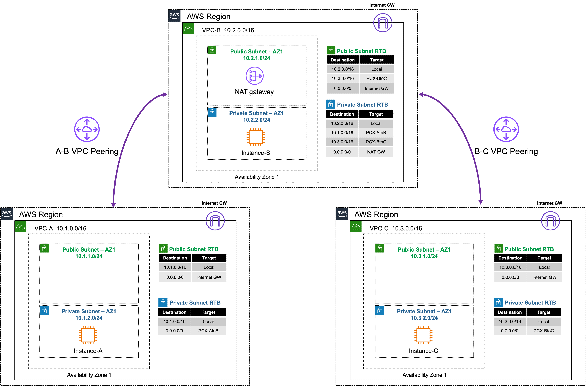
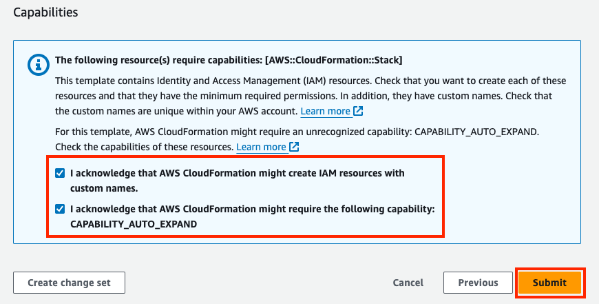
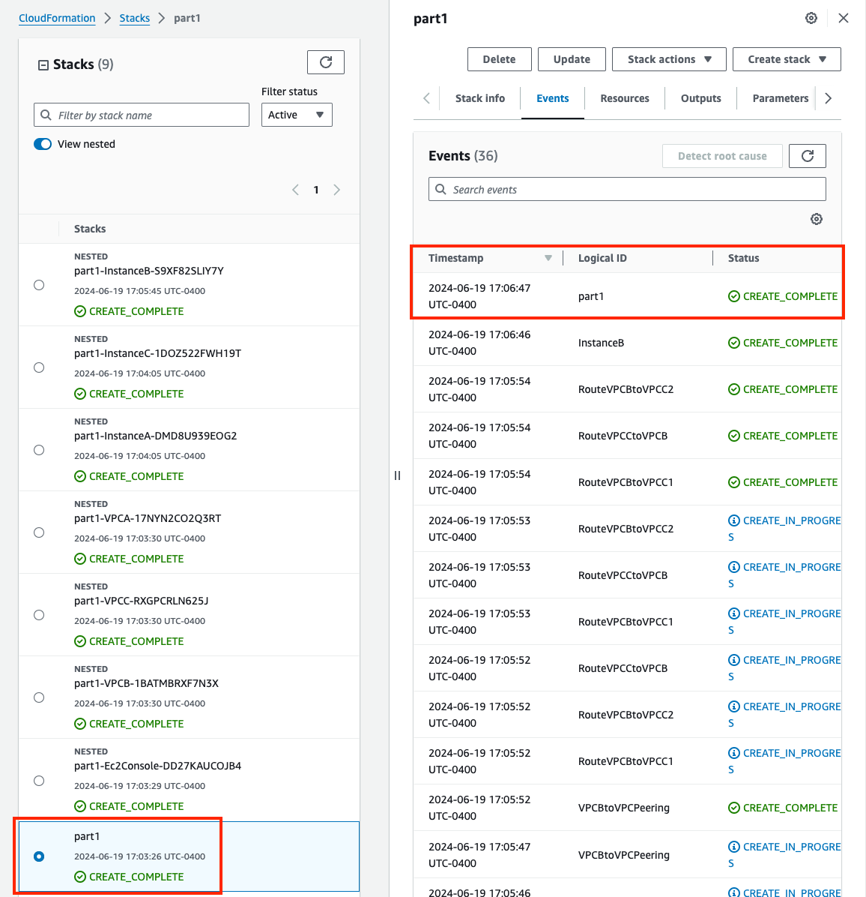
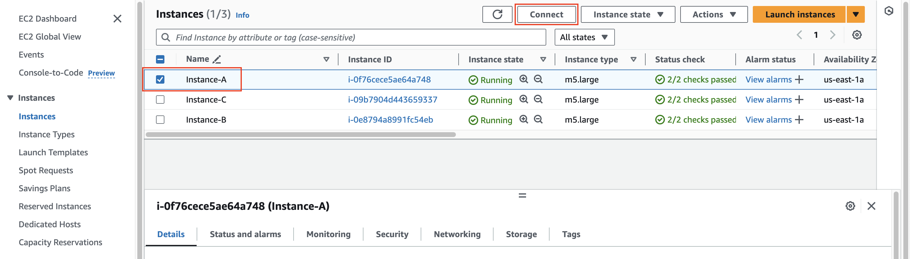
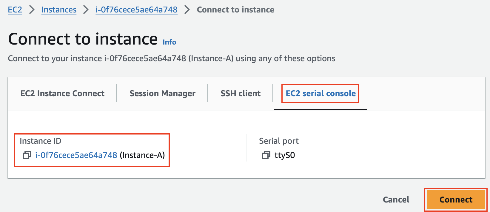
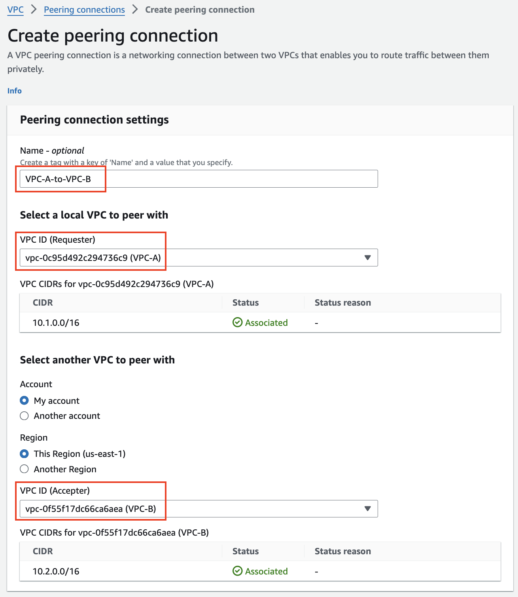
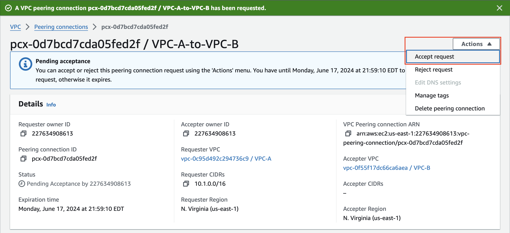
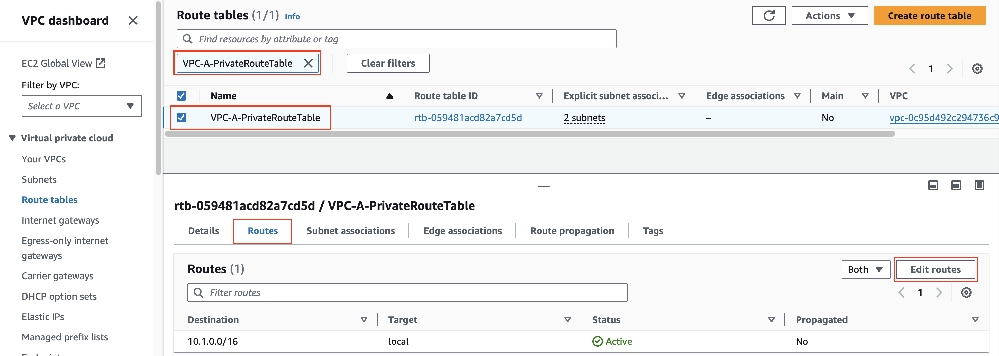
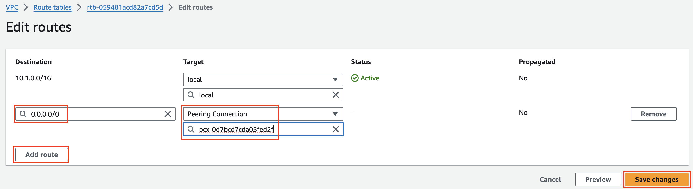
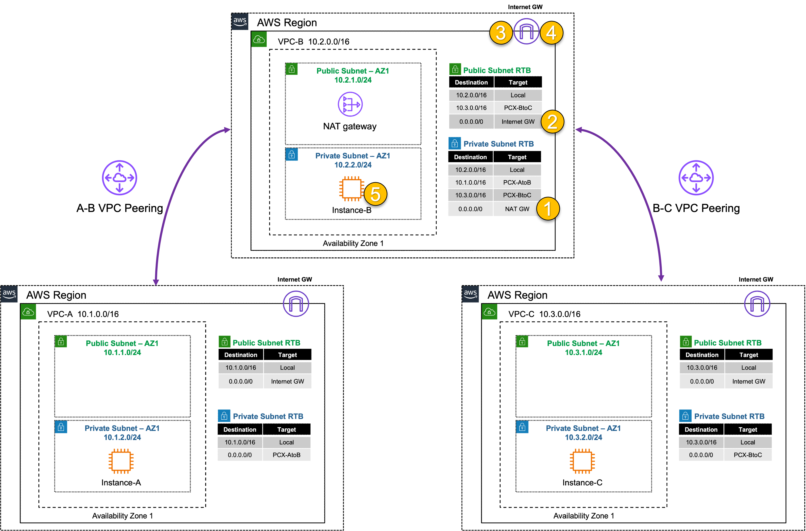

## **Public Inbound: Single VPC with IGW**
|                            |    |  
|----------------------------| ----
| **Goal**                   | Establish point to point access from VPC A to VPC B
| **Task**                   | Create a peering connection and VPC routes so EC2 Instance-A can ping Instance-B
| **Verify task completion** | Confirm point to point VPC connectivity with ping from EC2 Instance-A to B and Instance-B to C

{} 

There are no security controls in this example. Instance-B can freely communicate with the Internet.

{}

#### Summarized Steps (click to expand each for details)

0. Lab Environment Setup

    {}

- **0.1:** In the **QwikLabs Console left menu** find and copy the URL from the output **TemplateA**.
- **0.2:** In your AWS account, navigate to the **CloudFormation Console**, click **Create stack** in the upper right, then **With new resources (standard)**.
- **0.3:** **Paste** the URL copied previously into the **Amazon S3 URL** and click **Next**.
- **0.4:** Provide an alphanumeric name for the stack, such as part1, task1, etc and cick **Next**.
- **0.5:** **You must select an IAM role in the Permissions section** of the configure stack options page, then scroll down and click **Next**.
  
  {}
**If you do not select a the IAM role and continue with stack creation, this will fail!** If this occurred, simply create another stack with a different name and follow the steps closely for this section. 
  {}

- **0.6:** On the review and create page, scroll to the bottom, check the boxes to acknowledge the warnings, and click **Submit**.
  
- **0.7:** Once the main (ie not NESTED) CloudFormation stack shows as **Create_Complete**, proceed with the steps below.
  

    {}

1. Find EC2 Instance-A and verify it can't access Instance-B or C.

    {}

- **1.1:** In your AWS account, navigate to the **EC2 Console** and go to the **Instances page** (menu on the left).
- **1.2:** Find the **Instance-A** instance and select it.
  
- **1.3:** click **Connect > EC2 serial console**.
    - **Copy the instance ID** as this will be the username and click connect.
  
- **1.4:** Login to the EC2 instance:
    - username: <<copied Instance ID from above>>
    - Password: **`FORTInet123!`** 
- **1.5:** Run the command **`ping 10.2.2.10`** to ping Instance-B.
- **1.6:** Run the command **`ping 10.3.2.10`** to ping Instance-C.
- **1.7:** Run the command **`curl ipinfo.io`** to access the internet through VPC-B.
   - These **SHOULD NOT** work at this point.

- **1.8:** Run the command **`ifconfig ens5`** and take note of the instance IPv4 address.
- **1.9:** Run the command **`route -n`** and take note of the default route and the gateway IP for that route.

  {}

  The instance has a default route going to the private IP of 10.1.2.1. This is the AWS VPC router (aka intrinsic router), which is the first host IP in any subnet within a VPC. Reference this [**AWS document**](https://docs.aws.amazon.com/vpc/latest/userguide/subnet-sizing.html#subnet-sizing-ipv4) to learn what other IPs in a subnet are always used by AWS.

  {}
  
    {}

2. Create a VPC peering connection and VPC routes to allow Instance-A in VPC-A to reach Instance-B in VPC-B.

    {}

- **2.1:** Navigate to the **VPC Console** and go to the **Peering connections page** (menu on the left) and click **Create peering connection**.
- **2.2:** Provide a name then select **VPC-A as the requester** and **VPC-B as the Accepter** and click **Create peering connection** at the bottom of the page.
- **2.3:** On the next page, click **Action** and select **Accept Request**, and again on the pop-up window.
- **2.4:** Go to the **Route tables page** and find **VPC-A-PrivateRouteTable** , select the **Routes tab** and click **Edit Routes**.
- **2.5:** Create a route for **0.0.0.0/0** with the peering connection as your target.
- **2.6:** Repeat the same steps above to create a route for **10.1.0.0/16** in **VPC-B-PrivateRouteTable** to allow reply traffic.
  
  
  
  

  {}

3. Verify communication over the VPC Peering connection. 

    {}

- **3.1:** navigate to the **EC2 Console** and go to the **Instances page** (menu on the left).
- **3.2:** Find the **Instance-A** instance and select it.
  
- **3.3:** click **Connect > EC2 serial console**.
    - **Copy the instance ID** as this will be the username and click connect.
- **3.4:** Login to the EC2 instance:
    - username: <<copied Instance ID from above>>
    - Password: **`FORTInet123!`** 
- **3.5:** Run the command **`ping 10.2.2.10`** to ping Instance-B.
   - Now you can successfully ping Instance-B over the peering connection.
- **3.6:** Run the command **`ping 10.3.2.10`** to ping Instance-C.
- **3.7:** Run the command **`curl ipinfo.io`** to access the internet through VPC-B.
   - Instance-A **SHOULD NOT** be able to ping Instance-C or access the internet through VPC-B.

  {}
    
If you are unable to access the instance webpage, you may need to disconnect from your corporate VPN or change your Web Filter settings to allow access. An upstream proxy or web filter is blocking access.

  {}
  
    {}

4. Let's dig deeper to understand how all of this works.
   - VPC Peering is purely point to point between VPC CIDRs.

    {}

- **4.1:** In the **EC2 Console** go to the **Instances page** select the **Instance-B** instance.
- **4.2:** click **Connect > EC2 serial console**.
    - **Copy the instance ID** as this will be the username and click connect. 
- **4.3:** Login to the EC2 instance:
    - username: <<copied Instance ID from above>>
    - Password: **`FORTInet123!`** 
- **4.4:** Run the command **`ping 10.1.2.10`** to ping Instance-A.
- **4.5:** Run the command **`ping 10.3.2.10`** to ping Instance-C.
- **4.6:** Run the command **`curl ipinfo.io`** to access the internet.
   - All three commands should work.

- **4.7:** Connect to Instance-C.
- **4.4:** Run the command **`ping 10.1.2.10`** to ping Instance-A.
- **4.5:** Run the command **`ping 10.2.2.10`** to ping Instance-B.
- **4.6:** Run the command **`curl ipinfo.io`** to access the internet.
   - Instance-C should ping Instance-B but not be able to ping Instance-A or access the internet through VPC-B.
  {}

  The VPC peering connection is at the **VPC level**. This means the VPC peering connection is not directly tied to any VPC subnet or route table explicitly. AWS routing will only deliver traffic to an IP address that is within the destination VPC CIDR. The routes you created in both VPC-A and B's private route tables only direct traffic out of the local VPC to the target destination VPC. Reference this [**AWS documentation**](https://docs.aws.amazon.com/vpc/latest/peering/vpc-peering-basics.html#vpc-peering-limitations) to learn more about the limitations of VPC Peering.
    
  {}

- **4.7** Below is a step by step of the packet handling for the traffic from Instance-A to Instance-B.

Hop | Component | Description | Packet |
---|---|---|---|
1 | Instance-A -> 0.0.0.0/0 PCX | Outbound traffic destined to Instance-B is sent to the VPC router (its default gw) which routes traffic to the VPC peering connection as configured in the VPC-A-PrivateRouteTable. | **10.1.2.10:src-port -> 10.2.2.10:dst-port** |
2 | VPC Router -> Instance-B | Inbound traffic leaves the VPC peering connection and is sent to the VPC router which delivers traffic directly to Instance-B. | **10.1.2.10:src-port -> 10.2.2.10:dst-port** |
3 | Instance-B -> 10.1.0.0/16 PCX | Instance-B receives the traffic, seeing the original private source IP, and replies. This traffic is sent to the VPC router (its default gw) which routes the traffic to the VPC peering connection as configured in the VPC-B-PrivateRouteTable. | **10.2.2.10:src-port -> 10.1.2.10:dst-port** |
4 | VPC Router -> Instance-A | Response traffic leaves the VPC peering connection and is sent to the VPC router which delivers traffic directly to Instance-A. | **10.2.2.10:src-port -> 10.1.2.10:dst-port** |

  

  {}

  When Instance-A attempts to ping Instance-C or access the internet through VPC-B (using the default route), the VPC router at step 2 above would drop the traffic as the destination does not match the CIDR of VPC-B.
    
  {}

- **4.8** Below is a step by step of the packet handling for the traffic from Instance-B to the internet.

Hop | Component | Description | Packet |
---|---|---|---|
1 | Instance-B -> 0.0.0.0/0 NAT GW | Instance-B sends outbound traffic to the VPC router (it's default gw) which routes the traffic to NAT GW as configured in the VPC-B-PrivateRouteTable. | **10.2.2.10:src-port -> x.x.x.x:80** |
2 | NAT GW -> 0.0.0.0/0 IGW | NAT GW changes the source IP to its own private IP and sends the traffic to VPC router. The VPC router routes traffic to IGW as configured in the VPC-B-PublicRouteTable. | **y.y.y.y:src-port -> x.x.x.x:80** |
3 | IGW -> Internet | IGW changes the source IP to the associated EIP of NAT GW and routes the traffic to the internet. | **z.z.z.z:src-port -> x.x.x.x:80** |
4 | Internet -> IGW | IGW receives reply traffic, changes the source IP to the private IP of NAT GW, and sends the traffic to VPC router. The VPC router routes traffic to the NAT GW. | **x.x.x.x:80 -> y.y.y.y:dst-port** |
5 | NAT GW -> Instance-B | NAT GW changes the source IP back to the private IP of Instance-B and routes the traffic to the VPC router which delivers the traffic to Instance-B. | **x.x.x.x:80 -> 10.2.2.10:dst-port** |

  
  
  {}

5. Lab Environment Teardown

    {}

- **5.1:** Before deleting the main CloudFormation Stack, we must remove the VPC routes referencing the VPC peering connection, and the VPC peering connection itself.
- **5.2:** Navigate to the **VPC Console** and go to the **Peering connections page** (menu on the left), select the peering for VPC-A to B and click **Actions**, then select **Delete peering connection**. This will **prompt you to delete the related route table entries**. Select **Delete related route table entries**, then to confirm, type **delete** in the field and click **Delete**.
- **5.3:** Navigate to the **CloudFormation Console**, select the main stack you created and click **Delete**.
- **5.4:** Once the stack is deleted, proceed to the next task.

    {}

### Discussion Points
- VPC peering is a point to point connection only (no transitive routing).
- Full mesh is required to connect all VPCs together. 
  - For example connecting 10 VPCs would require 45 connections.
- VPC peering supports connections between VPCs:
  - In the same or different AWS Accounts
  - In the same (intra) or across (inter) regions
- When using inter-region peering, encryption is used.
- No Internet Gateway is required for VPC Peering (even when inter-region)
- Jumbo frames (9001 btyes) are only supported for intra-region connections, inter-region is limited to 1500 bytes.

**This concludes this task**
