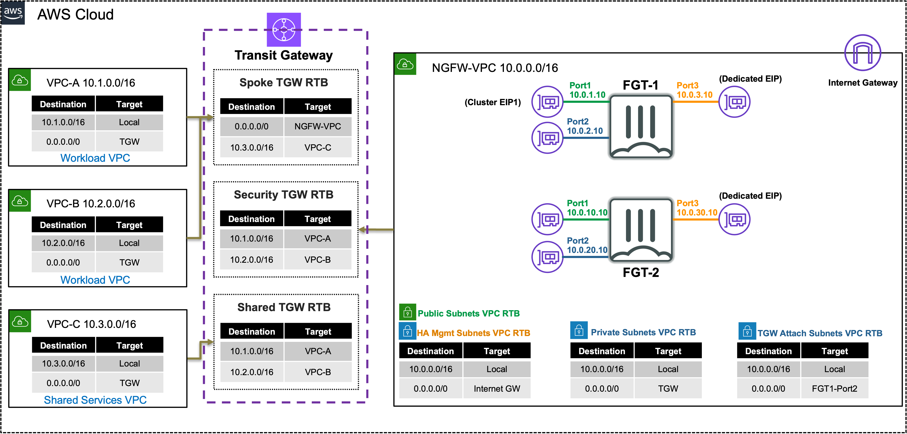

## **Private Outbound: Single VPC with NATGW** 
|                            |    |  
|----------------------------| ----
| **Goal**                   | Establish open and secured east/west (Inter-VPC) and outbound flows through the provisioned NGFW VPC and Transit gateway architecture.
| **Task**                   | Create attachment associations & propagations, update/create FortiGate routes and firewall policy to allow secured traffic.
| **Verify task completion** | Confirm outbound and east/west connectivity from EC2 Instance-A via Ping, HTTP, HTTPS.

#### Summarized Steps (click to expand each for details)

0. Lab Environment Setup

    {}

- **0.1:** In the **QwikLabs Console left menu** find and copy the URL from the output **TemplateB**.
- **0.2:** In your AWS account, navigate to the **CloudFormation Console**, click **Create stack** in the upper right, then **With new resources (standard)**.
- **0.3:** **Paste** the URL copied previously into the **Amazon S3 URL** and click **Next**.
- **0.4:** Provide an alphanumeric name for the stack, such as part2, task2, etc and cick **Next**.
- **0.5:** **You must select an IAM role in the Permissions section** of the configure stack options page, then scroll down and click **Next**.
  
  {}
**If you do not select a the IAM role and continue with stack creation, this will fail!** If this occurred, simply create another stack with a different name and follow the steps closely for this section. 
  {}

- **0.6:** On the review and create page, scroll to the bottom, check the boxes to acknowledge the warnings, and click **Submit**.
  
- **0.7:** Once the main/root CloudFormation stack shows as **Create_Complete**, proceed with the steps below.

    {}

1. Inspect the Transit Gateway VPC attachments.

    {}

- **1.1:** In the **VPC Console** go to the **Transit gateway attachments page** (menu on the left), then find and select the **VPC-A-spoke-vpc-attachment** attachment.
- **1.2:** On the **Details tab**, click **2 Subnets** under Subnet IDs.
  
- **1.3:** Copy the **Transit gateway attachment ID** and navigate to the **EC2 Console**.
- **1.4:** On the **Network Interfaces page**, paste the attachment ID into the search field and find the two interfaces.
  

  {}
Notice that the VPC attachment is associated or attached to two subnets in VPC-A. This means VPC route tables can be used to direct traffic that comes through the attachment. This is what allows transitive routing to occur.    
  {}

   {}

2. Create association and propagations for the VPC attachments to Transit Gateway Route Tables for east/west for shared services.

    {}

- **2.1:** Navigate to the **VPC Console** and go to the **Transit gateway route tables page** (menu on the left).
- **2.2:** Each tgw-rtb has an **associations** and **propagations** tab.
  
  
- **2.3:** Use the table below to create the associations and propagations to setup the environment for general east/west between VPC-A & B to VPC-C.

TGW-RTB Name | Associations | Propagations | 
---|---|---
NGFW-security-tgw-rtb | NGFW-security-vpc-attachment | VPC-A-spoke-vpc-attachment & VPC-B-spoke-vpc-attachment
NGFW-spoke-tgw-rtb | VPC-A-spoke-vpc-attachment & VPC-B-spoke-vpc-attachment | VPC-C-spoke-vpc-attachment
NGFW-sharedservices-tgw-rtb | VPC-C-spoke-vpc-attachment | VPC-A-spoke-vpc-attachment & VPC-B-spoke-vpc-attachment

    {}

3. Create a default route for centralized east/west and outbound through an inspection VPC.

    {}

- **3.1:** In the **VPC Console** and go to the **Transit gateway route tables page** (menu on the left).
- **3.2:** Select **NGFW-spoke-tgw-rtb**, select the **routes tab** and click **Create static route**.
- **3.3:** Create a route for **0.0.0.0/0** and the **NGFW-security-vpc-attachment** attachment.

   {}

4. Login to the FortiGate GUI, modify a route and add a Firewall Policy allowing east/west.

    {}

- **4.1:** Navigate to the **CloudFormation Console** and **toggle View Nested to off**.
- **4.2:** Select the main template and select the **Outputs tab**.
- **4.3:** Login to the FortiGate GUI, using the outputs **ClusterLoginURL**, **Username**, and **Password**.
  
- **4.4:** Upon login, navigate to **Network > Static Routes**.
- **4.5:** Edit the existing route to **10.0.0.0/16**.
  - This route needs to be updated to allow access to both the Spoke VPCs that are part of this centralized design. Change the destination to **10.0.0.0/8** and click **OK** to save the change.

- **4.6:** Navigate to **Policy & Objects > Firewall Policy** and click **Use new layout when prompted**, then click **Create new**. 

{}
If you accidentally did not use the new layout, you can change it by clicking on **Classic Layout** in the top right and switch to **Use new layout**.
{}

- **4.7:** Create a new policy with the **settings shown below** and click **OK** to allow east/west ICMP.

   {}

5. Test open east/west connectivity from Instance-A to Instance-C in shared services.

    {}

- **5.1:** Navigate to the **EC2 Console** and go to the **Instances page** (menu on the left).
- **5.2:** Find the **Instance-A** instance and select it.
- **5.3:** click **Connect > EC2 serial console**.
    - **Copy the instance ID** as this will be the username and click connect.
- **5.4:** Login to the EC2 instance:
    - username: <<copied Instance ID from above>>
    - Password: **`FORTInet123!`** 
- **5.5:** Run the command **`ping 10.3.2.10`** to ping Instance-C.
- **5.6:** Run the command **`curl 10.3.2.10`** to connect to Instance-C.
   - You should be successfully able to connect to Instance-C from Instance-A & B.

{}
Due to the configuration of the Transit gateway route tables, the east/west traffic between VPC-A & B to VPC-C is not being routed through the inspection VPC. That is why you are able to allow HTTP, SSH, and other between these VPCs. While this may be acceptable for very trusted and low security risk environments, it is better practice to have clear visibility and control on what communication is allowed.
{}

   {}

6. Test secured east/west and outbound connectivity from Instance-A to Instance-B.

    {}

- **6.1:** While still in the console session for Instance-A
- **6.2:** Run the command **`ping 10.2.2.10`** to ping Instance-B.
- **6.3:** Run the command **`curl 10.2.2.10`** to connect to Instance-B.
   - Ping should work while curl should fail due to firewall policy
- **6.4:** Run the command **`ping 8.8.8.8`** to ping a resource on the internet.
- **6.5:** Run the command **`curl ipinfo.io** to connect to a public application over HTTP.
- **6.6:** Run the command **`curl https://ipinfo.io** to connect to a public application over HTTPS.
- **6.7:** To test downloading an EICAR test virus over HTTPS to a local file, run the command **`curl -k --retry 2 --retry-all-errors https://secure.eicar.org/eicar.com.txt -o file.txt`**.
- **6.8:** To check the content of the file, run the command **`cat file.txt | grep -A 15 'High Security Alert'`**.
  - You will see you were blocked, and a block page was returned.
  - Ping and curl with HTTPS should work while curl with HTTP should fail due to firewall policy

{}
Due to the configuration of the Transit gateway route tables, the east/west traffic between VPC-A to VPC-B and VPC-A & B to the internet is being routed through the inspection VPC. This is allowing us to have better visibility and control from both layer 4 & 7. This allows us to trust but verify what is allowed and occurring in our environment.
{}

   {}

7. Let's dig deeper to understand how all of this works. 

    {}

{}	
[**Transit Gateway (TGW)**](https://docs.aws.amazon.com/vpc/latest/tgw/how-transit-gateways-work.html) is a highly scalable cloud router that connects your VPCs in the same region to each other, to on-premise networks, and even to the internet through one hub. With the use of multiple route tables for a single TGW, you can design hub and spoke routing for traffic inspection and enforcement of security policy across multiple VPCs. As the name implies, [**Transit Gateway supports transitive routing**](https://docs.aws.amazon.com/vpc/latest/tgw/TGW_Scenarios.html).

In this section, we used Transit gateway to provide open and direct east/west between certain VPCs (A & B to C) while providing controlled east/west and centralized egress for other VPCs (A to B). This allows broad routing decisions to be made on how traffic is handled for anything connecting to Transit gateway within the same region.

Key points to understand is that:
  - a single Transit gateway can have multiple route tables
  - multiple attachment types exist (VPC, VPN, Direct Connect (dedicated circuit), TGW Connect (GRE))
  - each attachment can only be associated to one route table
  - each attachment can be propagated to multiple route tables (ie VPC A & B)
  - additionally static and dynamic routes (covered in next section) can be added to route tables
{}

- **7.1:** In the FortiGate GUI navigate to **Log & Report > Forward Traffic**.  You should logs for the traffic you generated. 
- **7.2:** **Double click** a log entry to view the **Log Details**.

{}
The instance has the private IP 10.1.2.10/24, but is seen as coming from a public IP. This is because the primary FortiGate is providing secured outbound access to the internet for this private EC2 instance. This is because of the **VPC routes in all the VPCs (VPC-A and Inspection) are working together with the Transit Gateway (TGW) and Transit Gateway route tables to route** the in/outbound traffic through the primary FortiGate. This is a [**centralized design**](https://docs.aws.amazon.com/vpc/latest/tgw/transit-gateway-appliance-scenario.html) that is also commonly called an appliance, inspection, or security VPC.

Navigate to **Policy & Objects > Firewall Policy** and look at the **security profiles** being applied to the **secured-outbound-traffic-with-nat policy**. This pre-configured policy is applying source NAT to act as a NAT Gateway but is also applying advanced NGFW protection such as SSL MitM, Application Control, Intrusion Prevention, and Anti-Virus features.
{}

- **7.3** Below is a step by step of the packet handling for the outbound web traffic from Instance-A.

Hop | Component | Description | Packet |
---|---|---|---|
1 | Instance-A -> 0.0.0.0/0 TGW | Instance-A sends outbound traffic to the VPC router (its default gw) which routes traffic to TGW as configured in the Spoke1 VPC RTB. | **10.1.2.10:src-port -> x.x.x.x:80** |
2 | Spoke1-TGW-Attachment -> 0.0.0.0/0 Sec-TGW-Attachment | Spoke1-TGW-attachment is associated to the Spoke VPC TGW RTB. This TGW RTB has a default route to Sec-TGW-Attachment, so traffic is forwarded there. | **10.1.2.10:src-port -> x.x.x.x:80** |
3 | Sec-TGW-Attachment -> 0.0.0.0/0 FGT1-Port2 | Sec-TGW-Attachment is attached to the Security VPC TGW Attach Subnets which have a default route to primary FortiGate1 Port2, private interface. | **10.1.2.10:src-port -> x.x.x.x:80** |
4 | FGT1-Port1 -> 0.0.0.0/0 IGW | FGT1 changes the source IP to the private IP of Port1 as this has an EIP associated. FGT1 sends inspected & allowed traffic to the VPC router via Port1 (its default gw), which routes traffic to the IGW as configured in the Public Subnet VPC RTB. | **10.0.1.10:src-port -> x.x.x.x:80** |
5 | IGW -> Internet | IGW changes the source IP to the associated EIP of FortiGate1 Port1 and routes traffic to the internet. | **z.z.z.z:src-port -> x.x.x.x:80** |
6 | Internet -> IGW | IGW receives reply traffic and changes the source IP to the private IP of FortiGate1 Port1. The VPC router routes traffic to FortiGate1 Port1. | **x.x.x.x:80 -> 10.0.1.10:dst-port** |
7 | FGT1-Port2 -> 0.0.0.0/0 TGW | FGT1 receives traffic on Port1, changes the source IP to the private IP of Instance-A, and routes inspected & allowed traffic to the VPC router (10.0.0.0/8 static route out port2) via Port2. The VPC router sends traffic to TGW as configured in the Private Subnet VPC RTB. | **x.x.x.x:80 -> 10.1.2.10:dst-port** |
8 | Sec-TGW-Attachment -> 10.1.0.0/16 Spoke1-TGW-Attachment | Sec-TGW-Attachment is associated to the Sec VPC TGW RTB. This TGW RTB has a route for Spoke1 VPC via Spoke1-TGW-Attachment, so traffic is forwarded there. | **x.x.x.x:80 -> 10.1.2.10:dst-port** |
9 | Spoke1-TGW-Attachment -> Instance-A | Spoke1-TGW-Attachment is attached to subnets in Spoke1 VPC which have a local VPC route to reach Instance-A. | **x.x.x.x:80 -> 10.1.2.10:dst-port** |

  

    {}

8. Lab Environment Teardown

    {}

- **8.1:** Navigate to the **CloudFormation Console**, select the main stack you created and click **Delete**.
- **8.2:** Once the stack is deleted, proceed to the next task.

    {}

### Discussion Points
- TGW is essentially a regional router.
- TGW supports transitive routing and has many [**use cases**](https://docs.aws.amazon.com/vpc/latest/tgw/TGW_Scenarios.html).
- TGW supports the following attachments in the same region:
  - VPC (static propagation of VPC CIDR)
  - VPN (static or dynamic routing)
  - Direct Connect Gateway (static or dynamic routing)
  - TGW Connect (GRE over VPC or Direct Connect attachment, supports static or dynamic routing)
- TGW supports peering between TGWs in the same or different regions.
- Jumbo frames (8500 bytes) are supported for all connections except VPC (1500 bytes).
- Centralized Inspection VPC handles FortiGate NGFW inspection for any traffic flow (Inbound, Outbound, East/West).
  - [**Appliance Mode**](https://docs.aws.amazon.com/vpc/latest/tgw/transit-gateway-appliance-scenario.html) is required for active-passive designs to keep flows sticky to the primary FortiGate.
  - Advanced architectures for all of these scenarios can be [**found here**](https://github.com/FortinetCloudCSE/.github/blob/main/profile/AWS/README.md).
  
**This concludes this task**
