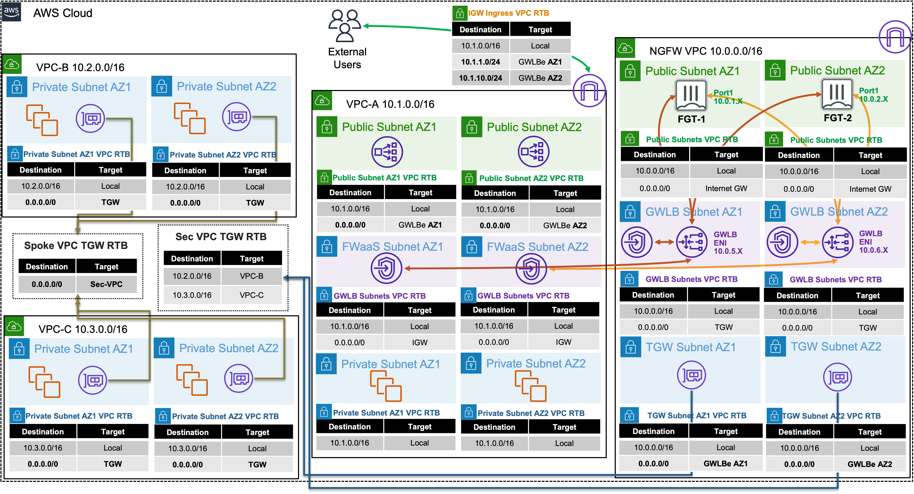
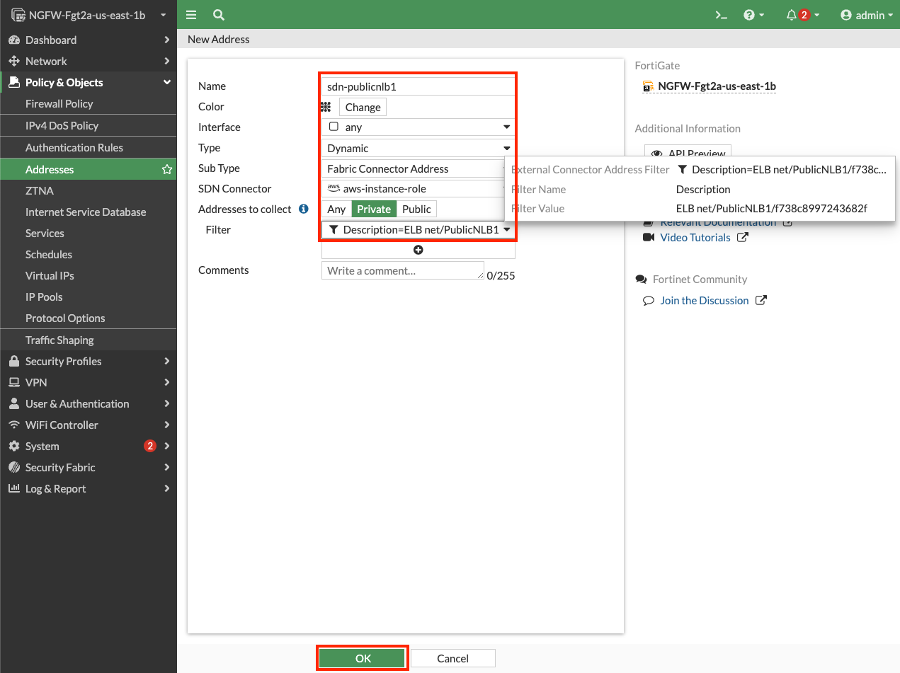
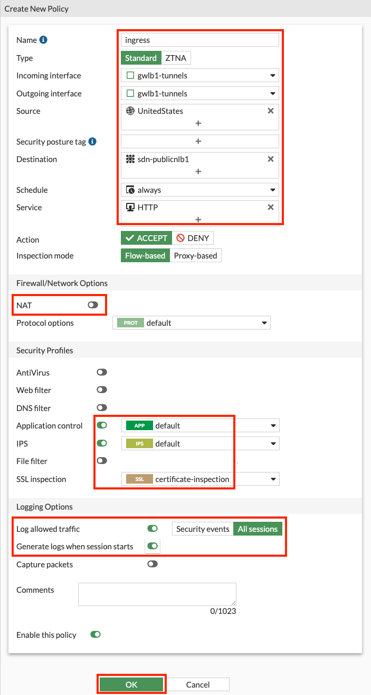
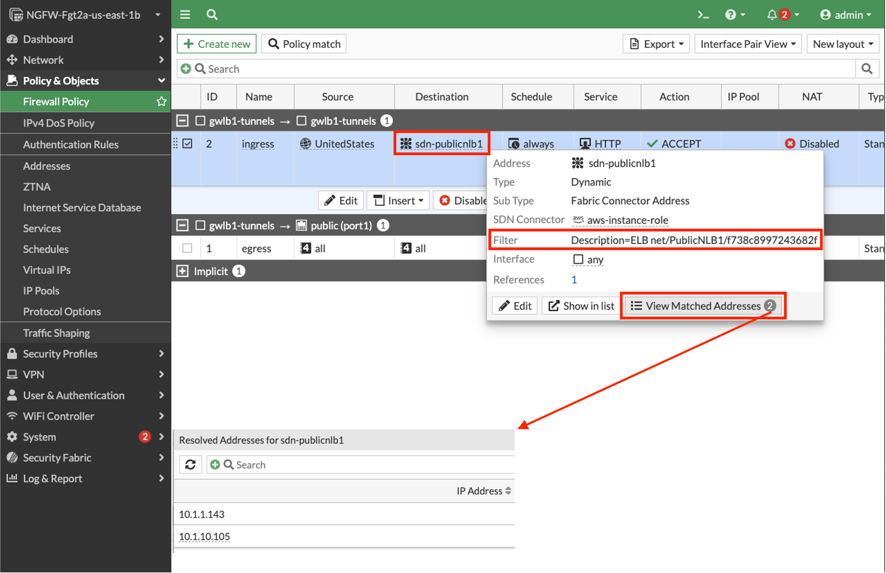
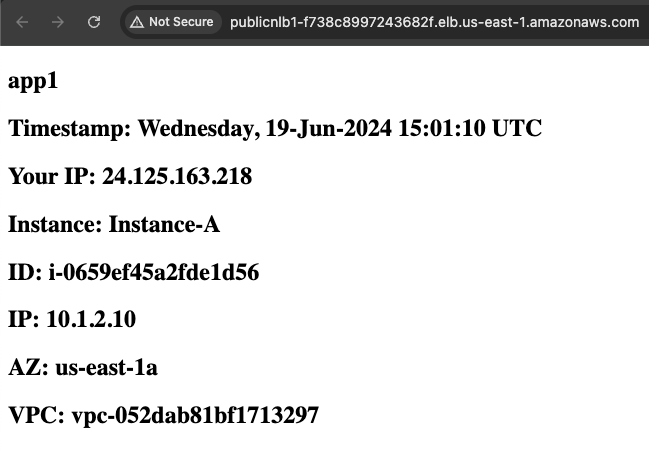
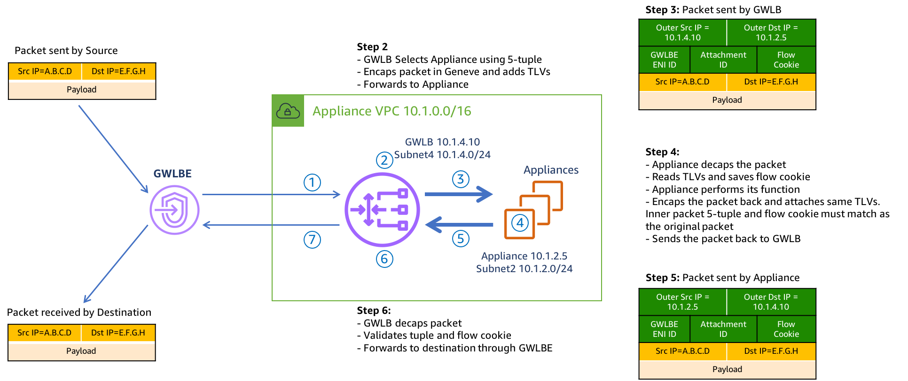
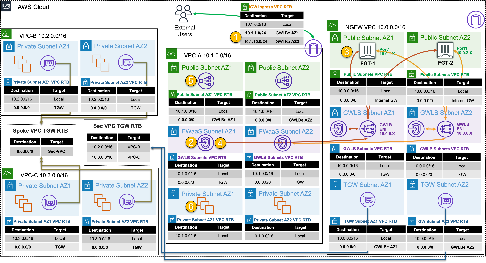
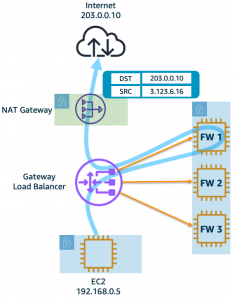
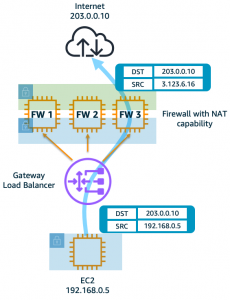
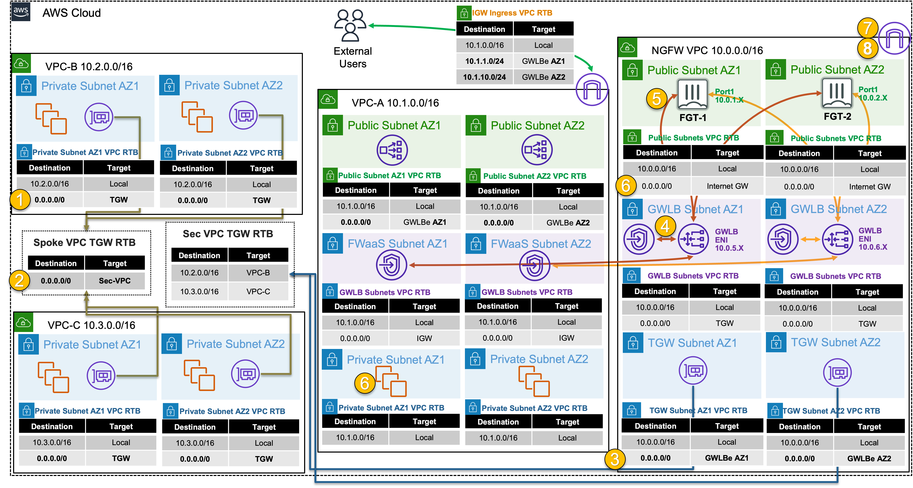

## **Service Insertion**
|                            |    |  
|----------------------------| ----
| **Goal**                   | Utilize the provisioned Gateway Load Balancer architecture to provide security for distributed ingress and centralized egress flows with FortiGate NGFW.
| **Task**                   | Create VPC routes and FortiGate Policy objects allowing both flows of traffic.
| **Verify task completion** | Confirm connectivity to Public NLB1 and from Instance-B.



#### Summarized Steps (click to expand each for details)

0. Lab Environment Setup

    {}

[](https://console.aws.amazon.com/cloudformation/home#/stacks/create/review?stackName=task4&templateURL=https%3A%2F%2Fhacorp-cloud-cse-workshop-us-east-1.s3.amazonaws.com%2Faws-fgt-201%2FMaster_FGT_201_Part4.template.json)

- **0.1:** In the **QwikLabs Console left menu** find and copy the URL from the output **TemplateD**.
- **0.2:** In your AWS account, navigate to the **CloudFormation Console**, click **Create stack** in the upper right, then **With new resources (standard)**.
- **0.3:** **Paste** the URL copied previously into the **Amazon S3 URL** and click **Next**.
- **0.4:** Provide an alphanumeric name for the stack, such as part4, task4, etc and cick **Next**.
- **0.5:** **You must select an IAM role in the Permissions section** of the configure stack options page, then scroll down and click **Next**.
  
  {}
**If you do not select a the IAM role and continue with stack creation, this will fail!** If this occurred, simply create another stack with a different name and follow the steps closely for this section. 
  {}

- **0.6:** On the review and create page, scroll to the bottom, check the boxes to acknowledge the warnings, and click **Submit**.
  
- **0.7:** Once the main/root CloudFormation stack shows as **Create_Complete**, proceed with the steps below.

    {}

1. Create VPC routes for ingress routing.

    {}

- **1.1:** In the **VPC Console** go to the **Endpoints page** (menu on the left) and look at the VPC Endpoints for VPC A.  You should see two endpoints, **one endpoint for each Availability Zone**.  Notes the **Endpoint IDs** as these will be used in the next step.

- **1.2:** Go to the **Route tables page** (menu on the left) and find **VPC-A-IgwRouteTable**, select the **Routes tab** and click **Edit routes**. Create routes for the two public subnets to go to the VPC endpoint in the same Availability Zone.

Route Table| CIDR | VPC Endpoint
---|---|---
VPC-A-IgwRouteTable | 10.1.1.0/24 | VPCE-... AZ1
VPC-A-IgwRouteTable | 10.1.10.0/24 | VPCE-... AZ2

- **1.3:** On the **Route tables page** (menu on the left) and find both **VPC-A-Public1RouteTable** and **VPC-A-Public2RouteTable**, select the **Routes tab** and click **Edit routes**. Create a default routeto go to the VPC endpoint in the same Availability Zone.

Route Table | CIDR | VPC Endpoint
---|---|---
VPC-A-Public1RouteTable | 0.0.0.0/0 | VPCE-... AZ1
VPC-A-Public2RouteTable | 0.0.0.0/0 | VPCE-... AZ2

    {}

2. Create an ingress FW policy using a dynamic address object for Public NLB1 in VPC-A on both FortiGate1 & 2.

    {}

- **2.1:** Navigate to the **CloudFormation Console** and **toggle View Nested to off**.
- **2.2:** Select the main template and select the **Outputs tab**.
- **2.3:** Login to **FortiGate1**, using the outputs **FGT1LoginURL**, **Username**, and **Password**.
- **2.4:** In the FortiGate GUI, navigate to **Policy & Objects > Addresses**, and click **Create new**.
- **2.5:** Create a dynamic address object with the **settings shown below**, including searching for the NLB with **PublicNLB1** to find the full filter, then click **OK**.

{}
Dynamic address objects allows creating address objects based on resource metadata such as VPC ID, Auto Scale Group, EKS Cluster or Pod, and even Tag Name + Value pairs applied to the resource. FortiOS is using AWS API calls behind the scenes such as ec2:DescribeInstances, ec2:DescribeNetworkInterfaces, eks:ListClusters, eks:DescribeCluster, etc to find running resources to match based on metadata and pull their IP address information. This is done on a frequent basis to keep the dynamic address object up to date automatically. **To learn more about all the public and private clouds this feature supports, check out our [**documentation**](https://docs.fortinet.com/document/fortigate/7.4.3/administration-guide/753961/public-and-private-sdn-connectors)**.
{}



- **2.6:** Navigate to **Policy & Objects > Firewall Policy** and click **Create new**.
- **2.7:** Create a new policy with the **settings shown below** and click **OK** to allow ingress traffic to the Public NLB in VPC-A.



- **2.8:** **Validate that the dynamic address objects** are automatically populated by hovering over both objects. In the popup menu, click **View Matched Addresses** button.



- **2.9:** **Repeate the above steps on FortiGate2** as this is an active - active design.

{}
You can use FortiManager to manage a single policy set (FW policies, address & security objects, etc) and apply this across multiple FortiGates in the same or different deployments.
{}

    {}


3.  Test distributed ingress to Public NLB1 (and Instance-A) through GWLB and FortiGate1 & 2.

    {}

- **3.1:** Navigate to the **CloudFormation Console** and **toggle View Nested to off**.
- **3.2:** Select the main template and select the **Outputs tab**.
- **3.1:** Copy the URL from **Application1URL** and navigate to this in your browser.
- **3.2:** You should see the web page with Instance-A and your connection details.

    

    {}

4. Let's dig deeper to understand how all of this works.

    {}

- **4.2** Here is an example of how GWLB routing works at a low level, including what information is tracked, and included in the GENEVE tunnel headers.

	

{}
Gateway Load Balancer provides a very scalable active - active design for bump in the wire inspection with FortiGates applying NGFW, SSL MitM, etc. This is a regional setup that can support VPCs regardless if there is centralized networking (ie Transit Gateway used) or more of a distributed setup (each VPC is an island).

Gateway Load Balancer receives all traffic through Gateway Load Balancer Endpoints (ie GWLBE also called VPC Endpoints or VPCE for short). GWLB does not have a route table to track source CIDRs but rather relies on the GWLBE/VPCE ID and will return inspected traffic directly back to the endpoint for VPC routing to then take over. 

Gateway Load Balancer is both a gateway in that it can be (more specifically the GWLBE/VPCE) a route target and it is a load balancer in that it is flow aware (tracks 3/5 tuple flows) and keeps flows sticky to each FortiGate.

The GWLBE/VPCE ID, a flow cookie, and other information is actually stored and passed to the FortiGates via the GENEVE tunnel headers.  Geneve is similar to VXLAN with optional TLVs (type length value triplets in the headers) to provide more context on the encapsulated data-plane traffic.  Reference [AWS Documentation](https://aws.amazon.com/blogs/networking-and-content-delivery/integrate-your-custom-logic-or-appliance-with-aws-gateway-load-balancer/) to find out more.

On a side note, sinve GWLB does not track source CIDRs for routing, this means that both GWLB and the FortiGates can support environments where there are overlapping CIDR blocks. You can inspect this traffic in the same regional deployment but this means you would be applying the same FW policies to the traffic.  It is best practice to either use separate deployments or to [use VDOMs and map your traffic from each GWLBE/VPCE to different VDOMs](https://docs.fortinet.com/document/fortigate-public-cloud/7.4.0/aws-administration-guide/299990/multitenancy-support-with-aws-gwlb) so that you can apply unique FW policies.
{}

- **4.2** Below is a step by step of the packet handling for the ingress web traffic to Public NLB1 in VPC-A.

Hop | Component                           | Description                                                                                                                                                                                                                                                                                                                                                                   | Packet |
---|-------------------------------------|-------------------------------------------------------------------------------------------------------------------------------------------------------------------------------------------------------------------------------------------------------------------------------------------------------------------------------------------------------------------------------|---|
1 | Internet -> 10.1.x.x/24 GWLBE(VPCE) | An inbound connection starts with DNS resolution of the Public NLB to a public IP for one of the Availability Zones. The first packet (TCP sync) will be seen at the IGW attached to the VPC where the NLB is deployed. The IGW will perform destination NAT to the private IP of the public NLB and forward this to the GWLBE/VPCE as configured in **VPC-A-IgwRouteTable**. | **<span style="color:blue">x.x.x.x:src-port</span> -> <span style="color:purple">10.1.x.x:80</span>** |
2 | GWLBE(VPCE) -> GWLB                 | GWLBE/VPCE will route the traffic to the associated GWLB network interface in the same Availability Zone. This is done behind the scene using AWS Private Link.                                                                                                                                                                                                               | **<span style="color:blue">x.x.x.x:src-port</span> -> <span style="color:purple">10.1.x.x:80</span>** |
3 | GWLB -> FGTs-Port1                  | GWLB receives the traffic, encapsulates this in a GENEVE tunnel and forwards this flow to one of the FGTs. Post inspection the FGTs return the traffic to GWLB, which then hairpins the traffic back to the original GWLBE/VPCE                                                                                                                                               | **<span style="color:blue">x.x.x.x:src-port</span> -> <span style="color:purple">10.1.x.x:80</span>** |
4 | GLBE(VPCE) -> 10.1.0.0/16 Local     | The GWLBe endpoint will then route the inspected traffic to the intrinsic router. The intrinsic router will route traffic directly to the NLB’s ENI as specified in the VPC route table assigned to the subnet.                                                                                                                                                               | **<span style="color:blue">x.x.x.x:src-port</span> -> <span style="color:purple">10.1.x.x:80</span>** |
5 | NLB -> Instance-A                   | The NLB will send traffic to a healthy target, in either AZ since cross zone load balancing is enabled. Instance-A is the only target so it receives the traffic                                                                                                                                                                                                              | **<span style="color:blue">x.x.x.x:src-port</span> -> <span style="color:black">10.1.2.10:80</span>** |
6 | Instance-A -> NLB                   | Instance-A will receive the traffic and respond. The return traffic will follow these steps in reverse.                                                                                                                                                                                                                                                                       | **<span style="color:black">10.1.2.10:80</span> -> <span style="color:blue">x.x.x.x:src-port</span>** |

  

    {}

5.  Test centralized egress from Instance-B through GWLB & FortiGates1/2.

    {}

- **5.1:** Navigate to the **EC2 Console** and go to the **Instances page** (menu on the left).
- **5.2:** Find the **Instance-B** instance and select it.
- **5.3:** click **Connect > EC2 serial console**.
    - **Copy the instance ID** as this will be the username and click connect.
- **5.4:** Login to the EC2 instance:
    - username: <<copied Instance ID from above>>
    - Password: **`FORTInet123!`** 
- **5.5:** Run the command **`ping 8.8.8.8`** to a resources on the internet
- **5.6:** Run the command **`curl ipinfo.io`** to connect to a resources on the internet
   - These connect successfully.

    {}

6. Let's dig deeper to understand how all of this works.

    {}

- **6.1:** Note that the output of **`curl ipinfo.io`** returned the public IP of one of the FortiGates connected to GWLB. If you continue to run the command, you will see that your outbound traffic is flowing through both FortiGates and being Source NAT'd to look like traffic is coming from their Elastice IPs.

{}
**One-Arm Model (Distributed)**

GWLB supports two different models of firewall deployments, one-arm and two-arm where a firewall appliance can also perform NAT.

In the one-arm model, the FortiGates will inspect traffic and forward this back to GWLB where Internet bound traffic is has NAT applied by a NAT GW.  Typically, the NAT GW will be in a workload VPC in a distributed design.  Distributed designs have GWLBe endpoints in each workload VPC requiring an attached Internet Gateway (IGW) and public load balancer or NAT GW.



We can use static and policy routes like below to support this setup.  In a 2 AZ deployment there are two static routes using [**priority setting**](https://community.fortinet.com/t5/FortiGate/Technical-Note-Routing-behavior-depending-on-distance-and/ta-p/198221) to bypass the reverse path filtering check when receiving data plane traffic over the GENEVE tunnels.  The static routes are default routes to simplify the config, but you could also specify a route for each spoke VPC for each GENEVE tunnel.  Also, there are two policy routes to hairpin traffic received over each GENEVE tunnel, back to the same one.

```
config router static
edit 1
set distance 5
set priority 100
set device gwlb1-az1
next
edit 2
set distance 5
set priority 100
set device gwlb1-az2
next
end
config router policy
edit 1
set input-device gwlb1-az1
set output-device gwlb1-az1
next
edit 2
set input-device gwlb1-az2
set output-device gwlb1-az2
next
```

**Two-Arm Model (Centralized)**

In the two-arm model, the FortiGates will inspect traffic and forward & SNAT traffic out port1 (public interface) to act as a NAT GW.  This removes the need for deploying NAT GWs in each AZ of each workload VPC.  This is a centralized design where the data plane traffic used TGW to reach the GWLBe endpoints in the inspection/security VPC and be inspected by the FortiGates.



We can use static and policy routes like below to support this setup.  In a 2 AZ deployment there are two static routes using [**priority setting**](https://community.fortinet.com/t5/FortiGate/Technical-Note-Routing-behavior-depending-on-distance-and/ta-p/198221) to bypass the reverse path filtering check when receiving data plane traffic over the GENEVE tunnels.  The static routes are default routes to simplify the config, but you could also specify a route for each spoke VPC for each GENEVE tunnel.  Also, there are two policy routes to hairpin traffic received over each GENEVE tunnel, back to the same one.  These policy routes will only hairpin traffic destined RFC1918 addresses and will route internet bound traffic out port1.

```
config router static
edit 1
set distance 5
set priority 100
set device gwlb1-az1
next
edit 2
set distance 5
set priority 100
set device gwlb1-az2
next
end
config router policy
edit 1
set input-device gwlb1-az1
set dst "10.0.0.0/255.0.0.0" "172.16.0.0/255.240.0.0" "192.168.0.0/255.255.0.0"
set output-device gwlb1-az1
next
edit 2
set input-device gwlb1-az2
set dst "10.0.0.0/255.0.0.0" "172.16.0.0/255.240.0.0" "192.168.0.0/255.255.0.0"
set output-device gwlb1-az2
next
```

**Supporting Both Models**

In a single region, you can have one deployment of FGTs & GWLB support both distributed and centralized designs.  This all comes down to implementing the appropriate routing at the VPC & TGW route tables and FortiGate routes.  For examples on the VPC & TGW routes for different designs, reference [**common architecture patterns**](71_usecase1.html).

Here is an example of the static & policy routes to support a distributed spoke1 VPC (CIDR 10.1.0.0/16) and centralized spoke2 VPC.  

```
config router static
edit 1
set distance 5
set priority 100
set device gwlb1-az1
next
edit 2
set distance 5
set priority 100
set device gwlb1-az2
next
end
config router policy
edit 1
set input-device gwlb1-az1
set src "10.1.0.0/16"
set output-device gwlb1-az1
next
edit 2
set input-device gwlb1-az2
set src "10.1.0.0/16"
set output-device gwlb1-az2
next
edit 3
set input-device gwlb1-az1
set dst "10.0.0.0/255.0.0.0" "172.16.0.0/255.240.0.0" "192.168.0.0/255.255.0.0"
set output-device gwlb1-az1
next
edit 4
set input-device gwlb1-az2
set dst "10.0.0.0/255.0.0.0" "172.16.0.0/255.240.0.0" "192.168.0.0/255.255.0.0"
set output-device gwlb1-az2
next
```

{}

- **6.2** Below is a step by step of the packet handling for the centralized egress from Instance-B.

Hop | Component | Description                                                                                                                                                                                                                                                        | Packet |
---|---|--------------------------------------------------------------------------------------------------------------------------------------------------------------------------------------------------------------------------------------------------------------------|---|
1 | Instance-B -> 0.0.0.0/0 TGW | Instance-B sends egress traffic to the VPC router (its default gw) which routes traffic to TGW as configured in the VPC-B-Private1RouteTable.                                                                                                                      | **<span style="color:black">10.2.2.10:src-port</span> -> <span style="color:blue">y.y.y.y:80</span>** |
2 | VPC-B-TGW-Attachment -> 0.0.0.0/0 NGFW-security-vpc-attachment | VPC-B-TGW-Attachment is associated to the Spoke VPC TGW RTB. This TGW RTB has a default route to NGFW-security-vpc-attachment, so traffic is forwarded there.                                                                                                      | **<span style="color:black">10.2.2.10:src-port</span> -> <span style="color:blue">y.y.y.y:80</span>** |
3 | NGFW-security-vpc-attachment -> 0.0.0.0/0 VPCE-... | NGFW-security-vpc-attachment is attached to the NGFW VPC TGW Attach Subnets which have a default route to the GWLBE/VPCE in the same Availability Zone.                                                                                                            | **<span style="color:black">10.2.2.10:src-port</span> -> <span style="color:blue">y.y.y.y:80</span>** |
4 | GWLBE/VPCE -> GWLB | GWLBE/VPCE will route traffic to the associated GWLB network interface in the same Availability Zone. This is done behind the scenes using AWS Private Link                                                                                                        | **<span style="color:black">10.2.2.10:src-port</span> -> <span style="color:blue">y.y.y.y:80</span>** |
5 | GWLB -> FGTs-Port1 | GWLB receives the traffic, encapsulates this in a GENEVE tunnel and forwards this flow to one of the FGTs.                                                                                                                                                         | **<span style="color:black">10.2.2.10:src-port</span> -> <span style="color:blue">y.y.y.y:80</span>** |
6 | FGTs-Port1 -> 0.0.0.0/0 IGW | FGTs changes the source IP to the private IP of Port1 as this has an EIP associated. FGTs sends inspected & allowed traffic to the VPC router via Port1 (its default gw), which routes traffic to the IGW as configured in the NGFW Public Subnet VPC Route Table. | **<span style="color:red">10.0.x.x:src-port</span> -> <span style="color:blue">y.y.y.y:80</span>** |
7 | IGW -> Internet | IGW changes the source IP to the associated EIP of FortiGates Port1 and routes traffic to the internet.                                                                                                                                                            | **<span style="color:red">z.z.z.z:src-port</span> -> <span style="color:blue">y.y.y.y:80</span>** |
8 | Internet -> IGW | IGW receives reply traffic and changes the source IP to the private IP of FortiGates Port1. The VPC router routes traffic to FortiGates Port1. The return traffic will follow these steps in reverse.                                                              | **<span style="color:blue">y.y.y.y:80</span> -> <span style="color:red">10.0.x.x:src-port</span>** |

  

    {}

7. Lab Environment Teardown

    {}

- **7.1:** Before deleting the main CloudFormation Stack, we must remove the VPC routes referencing the GWLBE/VPCEs.
- **7.2:** Navigate to the **VPC Console** and go to the **Route tables page** (menu on the left), and delete the following routes from the route tables shown below:

Route Table| CIDR | VPC Endpoint
---|---|---
VPC-A-IgwRouteTable | 10.1.1.0/24 | VPCE-... AZ1
VPC-A-IgwRouteTable | 10.1.10.0/24 | VPCE-... AZ2
VPC-A-Public1RouteTable | 0.0.0.0/0 | VPCE-... AZ1
VPC-A-Public2RouteTable | 0.0.0.0/0 | VPCE-... AZ2

- **7.3:** Navigate to the **CloudFormation Console**, select the main stack you created and click **Delete**.
- **7.4:** Once the stack is deleted, proceed to the next task.

    {}

### Discussion Points
- GWLB is a regional service that is both a gateway (VPC route target) and flow aware load balancer.
  - This allows very scalable active-active inspection for all directions of traffic.
  - No SNAT requirement to keep flows sticky to the same FGT as GWLB is flow aware.
- GWLB and FortiGates supports one and two arm mode (distributed vs centralized egress access & NAT GW replacement).
- Jumbo frames (8500 bytes) are supported.
- Inspection VPC handles FortiGate NGFW inspection for any traffic flow (Inbound, Outbound, East/West) and for any network design (distributed vs centralized).
  - [**Appliance Mode**](https://docs.aws.amazon.com/vpc/latest/tgw/transit-gateway-appliance-scenario.html) is required for active-passive designs to keep flows sticky to the primary FortiGate.
  - Advanced architectures for all of these scenarios can be [**found here**](https://github.com/FortinetCloudCSE/.github/blob/main/profile/AWS/README.md).

**This concludes this task**
