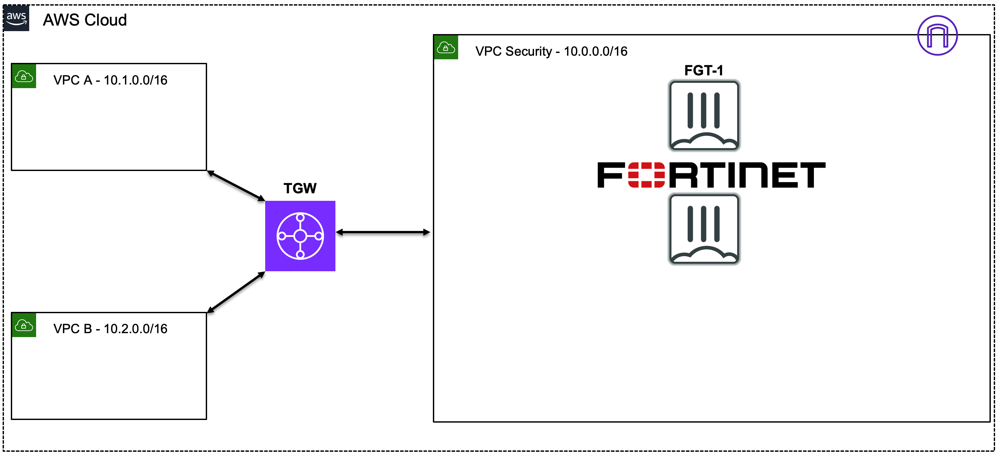

Acme Corp is migrating an on-premises 3-tier web app (web, application, database) to Amazon Web Services (AWS).

You will learn how FortiGates can address the following standard **concerns and requirements** when migrating applications and workloads to public cloud. 

**Concerns:**    
  - Exposure to inbound internet attacks
  - Environment and application segmentation to reduce exploit blast radius
  - Next generation firewall (**NGFW**) protection and URL filtering for outbound web traffic 
  - Simple security policy across corporate cyber infrastructure    
  
**Corporate Requirements:**    
  - Regional, highly available architecture (multiple availability zones (AZs))
  - NGFW protection featuring FortiGate FortiGuard advanced protection
  - Logging of all traffic

## Workshop Goals

You will learn how to use FortiGate NGFW deployed as AWS EC2 instances to protect traffic flows in Advanced AWS architecture patterns, as well as some fundamental AWS networking concepts.

The intent is to help clarify the following:    
  * Advanced AWS networking concepts such as VPC Peering, Transit Gateway (TGW), and Gateway Load Balancer (GWLB)
  * Use of FortiGate instances in AWS to secure inbound, outbound, and East/West traffic flows
  * AWS centralized architecture with Transit Gateway (TGW) and Gateway Load Balancer (GWLB), and the FortiGate security VPC concept
